# **KS0428 Mini Tank Robot V2 Arduino tutorial**

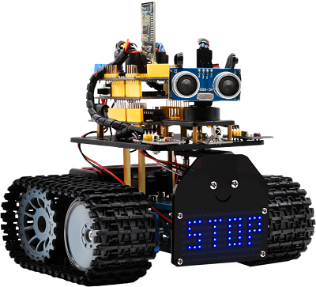

# Read me frist

 **Download the APP, Code and library from the link: <https://fs.keyestudio.com/KS0428>**

# 1.Introduction

Nowadays, technological education such as VR, kids’ programming, and artificial intelligence, has become a mainstream in educational industry. Thereby, people attach more importance to STEAM education.

As Arduino is notably famous in Maker education sector. Keyestuido surf this current and launch a smart mini tank robot which is a combination of Arduino and programming.

So what is Arduino? Arduino is an open-source electronics platform based on easy-to-use hardware and software. Arduino boards are able to read inputs - light on a sensor, a finger on a button, or a Twitter message - and turn it into an output - activating a motor, turning on an LED, publishing something online.

Based on this, Keyestudio team has designed a mini tank robot. It has a processor which is programmable using the Arduino IDE, to map its pins to sensors and actuators by a shield that plug in the processor, and it reads sensors and controls the actuators and decides how to operate.

It can perform multiple functions like obstacle avoidance, IR remote control, BT control, light following and so on.

Detailed 15 learning projects, from simple to complex, which guide you to build up your own smart mini tank robot and provide the basic knowledge of sensors and modules. Moreover, it is the best choice for graphical programming education.

# 2.Features

1.Multi-purpose function: Multi-purpose function: Obstacle avoidance, following, IR remote control, Bluetooth control, ultrasonic following and facial emoticons display.

2.Simple assembly: No soldering circuit required, complete assembly easily.

3.High Tenacity: Aluminum alloy bracket, metal motors, high quality wheels and tracks

4.High extension: connect numerous sensors and modules through motor driver shield and sensor shield

5.Multiple controls: IR remote control, App control(iOS and Android system)

6.Basic programming：C language code of Arduino IDE.

# 3.Specification

Working voltage: 5v

Input voltage: 7-12V

Maximum output current: 2A

Maximum power dissipation: 25W (T=75℃)

Motor speed: 5V 200 rpm/min

Motor drive mode: dual H bridge drive (L298P)

Ultrasonic induction angle: \<15 degrees

Ultrasonic detection distance: 2cm-400cm

Infrared remote control distance: 10 meters (measured)

Bluetooth remote control distance: 50 meters (measured)

# 4.Product List

When you get this robot kit, please make sure that all the parts listed below are delivered. Otherwise, please feel free to contact us for any missing components.

| **Electronic Parts** |                                                 |      |                                                                                      |
|----------------------|-------------------------------------------------|------|--------------------------------------------------------------------------------------|
| \#                   | Name                                            | QTY  | Picture                                                                              |
| 1                    | KEYESTUDIO V4.0 Development Board               | 1    | 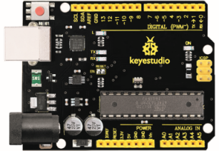                                      |
| 2                    | L298P Shield                                    | 1    |  |
| 3                    | V5 Sensor Shield                                | 1    |                               |
| 4                    | HC-SR04 Ultrasonic Sensor                       | 1    | 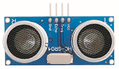                                      |
| 5                    | HM-10 Bluetooth-4.0 Module                      | 1    | 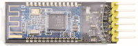                                      |
| 6                    | Remote Control                                  | 1    |                                |
| 7                    | 8X16 LED Panel                                  | 1    |  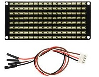            |
|                      | HX-2.54 4P Female Dupont Line                   | 1    |                                                                                      |
| 8                    | 9G Servo Motor                                  | 1    | 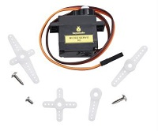                       |
| 9                    | IR Receiver Module                              | 1    | 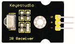                                      |
| 10                   | Photocell Sensor                                | 2    | 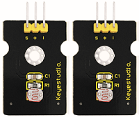                                      |
| 11                   | Red LED                                         | 1    | 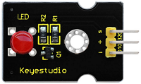                                      |
| Components           |                                                 |      |                                                                                      |
| 1                    | Acrylic Board                                   | 1    |                                       |
| 2                    | Tank Robot Acrylic Board                        | 1    |                              |
| 3                    | Metal Holder                                    | 4    | 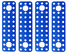                                   |
| 4                    | L-type Bracket                                  | 1    | 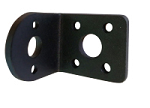                                      |
| 5                    | Tank Driver Wheel                               | 2    | 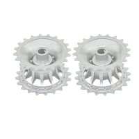                                      |
| 6                    | Tank Load-bearing Wheel                         | 2    | 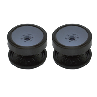                                      |
| 7                    | Caterpillar Band                                | 2    |                                       |
| 8                    | Metal Motor                                     | 2    | 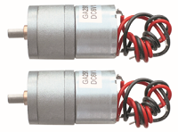                                      |
| 9                    | Plastic Platform (PC)                           | 1    | 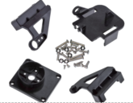                                      |
| 10                   | USB Cable (1m)                                  | 1    | 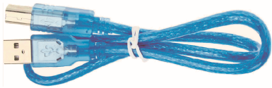                                      |
| 11                   | 2.54 3pin F-F Dupont Wire 20cm                  | 5    | 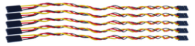                                      |
| 12                   | F-F Dupont Wire (15CM)                          | 10   |                                   |
| 13                   | Supportive Parts (27\*27\*16MM, Blue)           | 2    |  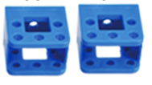                                     |
| 14                   | 18650 2-Slot Battery Holder                     | 1    | 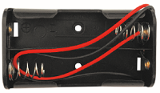                                      |
| 15                   | （**Not included**）18650 Battery               | 2    | 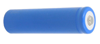                                      |
| Nuts/Screws          |                                                 |      |                                                                                      |
| 1                    | Copper Bush                                     | 2    |                                       |
| 2                    | Flange Bearing                                  | 4    |                                       |
| 3                    | Hexagon Copper Bush(M3\*10MM)                   | 10   | 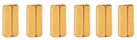                                      |
| 4                    | Hexagon Copper Bush (M3\*45MM)                  | 4    | 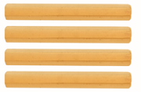                                      |
| 5                    | Copper Coupler                                  | 2    |                                       |
| 6                    | M3\*10MM Flat Head Screws                       | 3    | 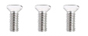                                      |
| 7                    | Inner Hexagon Screws (M3\*6MM)                  | 20   | 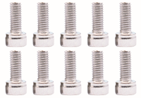                                      |
| 8                    | Inner Hexagon Screws (M3\*8MM)                  | 10   | 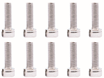                                      |
| 9                    | Inner Hexagon Screws (M3\*25MM)                 | 4    | 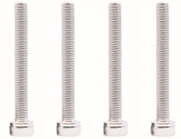                                      |
| 10                   | Inner Hexagon Screws (M4\*12MM)                 | 4    |                                       |
| 11                   | Inner Hexagon Screws (M4\*40MM)                 | 4    | 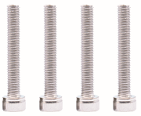                                      |
| 12                   | Inner Hexagon Screws (M4\*50MM)                 | 2    |                                       |
| 13                   | M3 Nuts                                         | 14   |                                       |
| 14                   | M4 Self-locking Nuts                            | 2    | 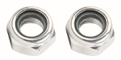                                      |
| 15                   | M2 Nuts                                         | 8    | 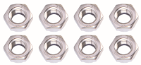                                      |
| 16                   | M4 Nuts                                         | 10   |  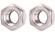                                     |
| 17                   | M2\*10MM Round Head Screws                      | 6    |  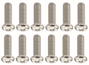                                     |
| 18                   | M3\*12MM Round Head Screws                      | 8    |                                       |
| **Tools**            |                                                 |      |                                                                                      |
| 1                    | 2.0\*40MM Blue and Black Slotted Screwdriver    | 1    | 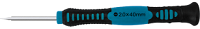                                      |
| 2                    | 2.0\*40MM Purple and Black Phillips Screwdriver | 1    |                                       |
| 3                    | M1.5 Hex Key Nickel Plated Allen Wrench         | 1    |                          |
| 4                    | M2.5 Hex Key Nickel Plated Allen Wrench         | 1    |                            |
| 5                    | M3 Hex Key Nickel Plated Allen Wrench           | 1    |                                 |
| 6                    | Nylon Cable Ties                                | 6    | 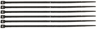                                      |
| 7                    | 8MM Winding Pipe                                | 12CM | 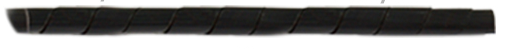                                      |
| 8                    | Decorative Cardboard                            | 1    |                                       |


# 5.Install Arduino IDE and Driver

### Installing Arduino IDE

When you get control board, you need to download Arduino IDE and driver firstly.

You could download Arduino IDE from the official website:

<https://www.arduino.cc/>, click the **SOFTWARE** on the browse bar to enter download page, as shown below:

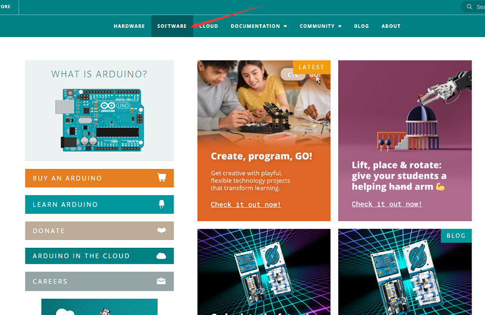

There are various versions of IDE for Arduino. Just download a version compatible with your system. Here we will show you how to download and install the windows version of Arduino IDE.

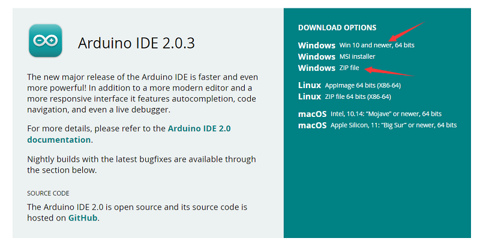

You can choose between the Installer (.exe) and the Zip packages. We suggest you use the first one that installs directly everything you need to use the Arduino Software (IDE), including the drivers. With the Zip package you need to install the drivers manually. The Zip file is also useful if you want to create a portable installation.


You just need to click JUST DOWNLOAD.

###  Keyestudio V4.0 Development Board

You need to know that keyestudio V4.0 development board is the core of this smart car.

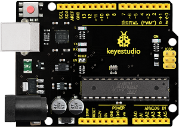

keyestudio V4.0 development board is an Arduino uno-compatible board, which is based on ATmega328P MCU, and with a cp2102 Chip as a UART-to-USB converter.


It has 14 digital input/output pins (of which 6 can be used as PWM outputs), 6 analog inputs, a 16 MHz quartz crystal, a USB connection, a power jack, 2 ICSP headers and a reset button.


It contains everything needed to support the microcontroller. Simply connect it to a computer with a USB cable or power it via an external DC power jack (DC 7-12V) or via female headers Vin/ GND(DC 7-12V) to get started.

| Microcontroller             | ATmega328P-PU                                            |
|-----------------------------|----------------------------------------------------------|
| Operating Voltage           | 5V                                                       |
| Input Voltage (recommended) | DC7-12V                                                  |
| Digital I/O Pins            | 14 (D0-D13)  (of which 6 provide PWM output)             |
| PWM Digital I/O Pins        | 6 (D3, D5, D6, D9, D10, D11)                             |
| Analog Input Pins           | 6 (A0-A5)                                                |
| DC Current per I/O Pin      | 20 mA                                                    |
| DC Current for 3.3V Pin     | 50 mA                                                    |
| Flash Memory                | 32 KB (ATmega328P-PU) of which 0.5 KB used by bootloader |
| SRAM                        | 2 KB (ATmega328P-PU)                                     |
| EEPROM                      | 1 KB (ATmega328P-PU)                                     |
| Clock Speed                 | 16 MHz                                                   |
| LED_BUILTIN                 | D13                                                      |

###  Installing the driver for Windows system

Let’s install the driver of keyestudio V4.0 board. The USB-TTL chip on V4.0 board adopts CP2102 serial chip.

**Windows system**


You can download the driver of the CP2101 in the following link.

<https://www.silabs.com/developers/usb-to-uart-bridge-vcp-drivers?tab=downloads>

For Windows system, you can select the first driver to download and upzip it.

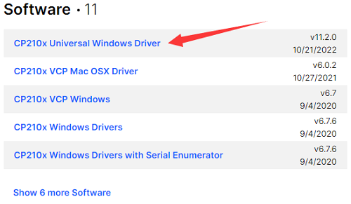


Then open the device manager of computer. Right click Computer----- Properties----- Device Manager


The yellow exclamation mark on the page implies that the driver of CP2101 isn’t installed. Next, you should double-click the hardware to update the driver.


Click“OK”to enter the following page, click“browse my computer for updated driver software”. As shown below:


Navigate to the CP210x_Universal_Windows_Driver unzip folder that you have downloaded and click Next.


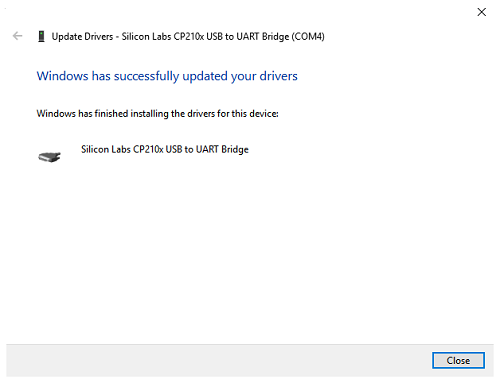

Open device manager, you will find the yellow exclamation mark disappear. The driver of CP2102 is installed successfully.


###  Installing the driver for MAC system

**MAC system**


You can download the driver of the CP2101 in the following link.

<https://www.silabs.com/developers/usb-to-uart-bridge-vcp-drivers?tab=downloads>

For MacOS system, you can select the this driver to download and upzip it.


Open the driver folder and double-click SiLabsUSBDriverDisk.dmg file.


4.You will view following files as follows:


5\. Double-click Install CP210x VCP Driver, tick Don’t warn me and click Open.


Click Continue.


Click Continue and Agree.


Click Continue and enter your user password.


9.Select Open Security Preferences.


Click the lock then enter your user’s password to authorize.


Then click Allow


12.Back to installation page, and wait to install.


Successfully installed 

###  Arduino IDE Setting

Clickicon，open Arduino IDE.

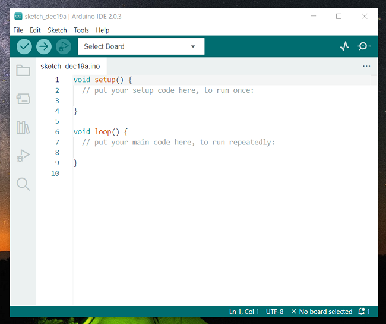

To avoid the errors when uploading the program to the board, you need to select the correct Arduino board that matches the board connected to your computer.

Then come back to the Arduino software, you should click Tools→Board, select the board. (as shown below)

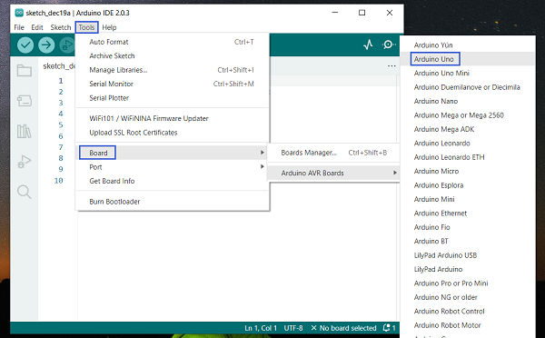

Then select the correct COM port (you can see the corresponding COM port after the driver is successfully installed)

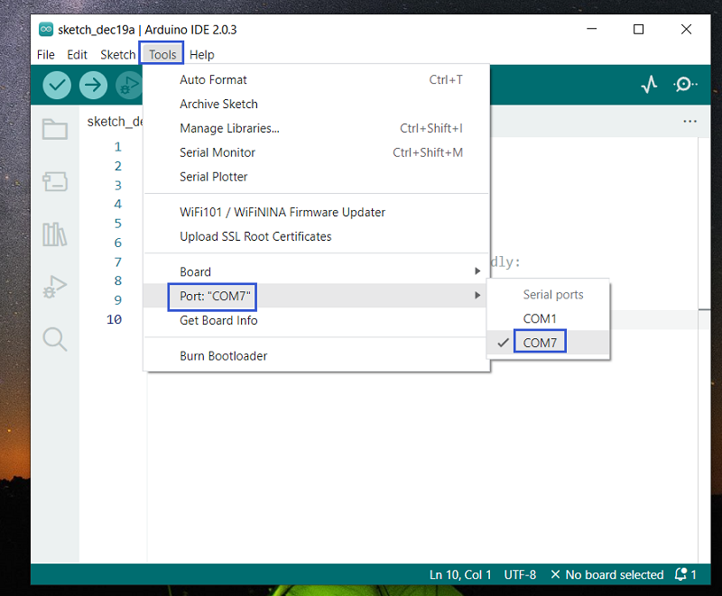

Before uploading the program to the board, let’s demonstrate the function of each symbol in the Arduino IDE toolbar.

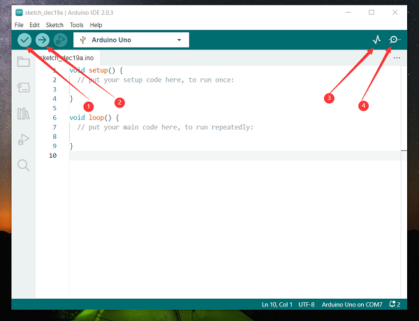

1- Used to verify whether there is any compiling mistakes or not.

2- Used to upload the sketch to your Arduino board.

3- Used to send the serial data received from board to the serial plottle.

4- Used to send the serial data received from board to the serial monitor.

###  Start First Program

Open the file to select Example, choose BLINK from BASIC, as shown below:

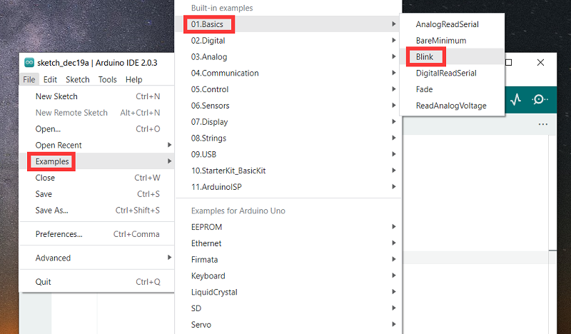 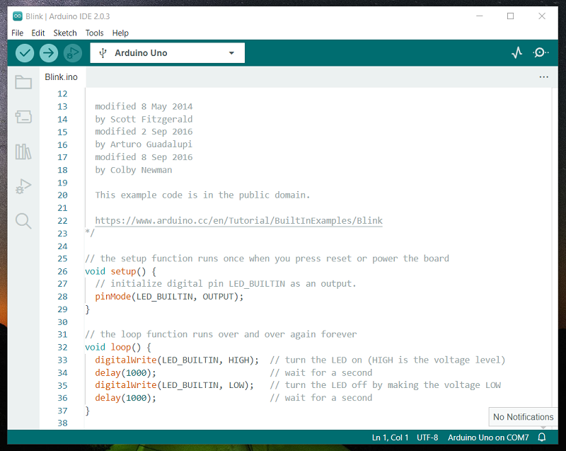

Set board and COM port, the corresponding board and COM port are shown on the lower right of IDE.

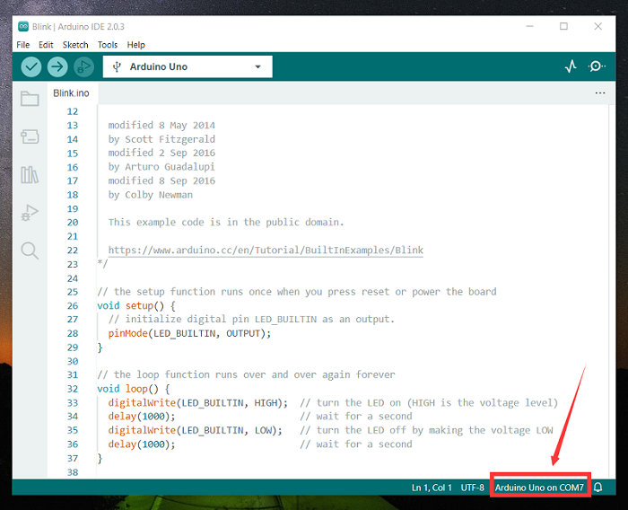

Clickto start compiling the program, check errors.

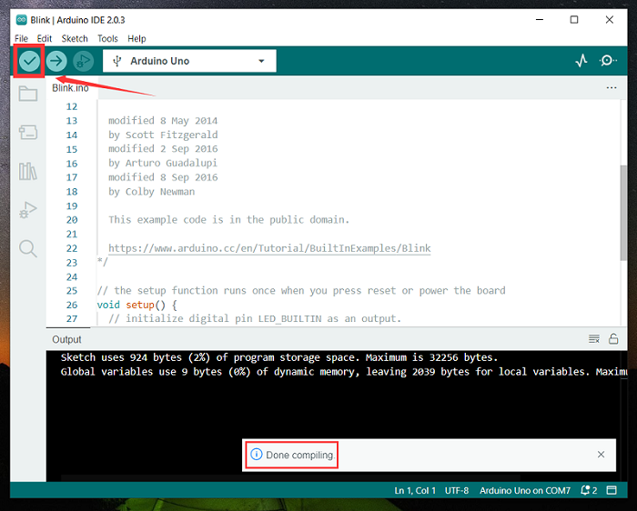

Clickto upload the program, upload successfully.

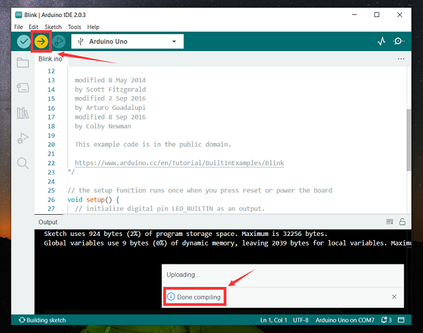

Upload the program successfully, the onboard LED lights on for 1s, lights off for 1s. Congratulation, you have finished the first program.

# 6. How to Add Libraries?

**What are Libraries ?**

[Libraries](https://www.arduino.cc/en/Reference/Libraries) are a collection of code that makes it easy for you to drive a sensor,display, module, etc.

For example, the built-in LiquidCrystal library helps talk to LCD displays. There are hundreds of additional libraries available on the Internet for download.

The built-in libraries and some of these additional libraries are listed in the reference.

<https://www.arduino.cc/en/Reference/Libraries>

**Add ZIP Libraries**

When you want to add a zip library, you need to download it as a ZIP file, put in the proper directory. The Libraries needed to run the mini tank can be found on：<https://fs.keyestudio.com/KS0428>

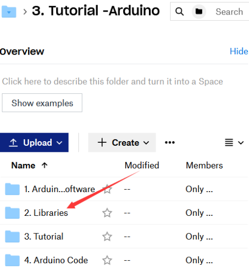

Click Sketch----\>Include Library—\>Add.ZIP Library，then Then navigate to the library file you downloaded and click "open."

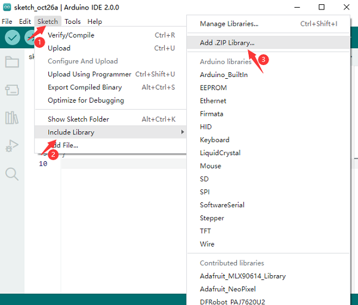


Import the library. You can find it in the include library list.


Now, you import libraries successfully.

# 7.Projects

The whole project begins with basic programs. Starting from simple to complex, the lessons will guide you to assemble the robot car and absorb the knowledge of electronic and machinery step by step. **If you want to start directly by installing the robot, you can skip to our [assembly-guide](https://ks0428-mini-tank-robot-v2-for-arduino.readthedocs.io/en/latest/KS0428-Arduino.html#assembly-guide).**


**Note:** (G), marked on each sensor and module, is negative pole and connected to “G”, ”-”or “GND”on the sensor shield and control board ; (V) is positive pole and linked with V , VCC, + or 5V on the sensor shield or control board.

### Project 1: LED Blink


   **Description**

For starters and enthusiasts, LED Blink is a fundamental program. LED, the abbreviation of light emitting diodes, consists of Ga, As, P, N chemical compounds and so on. The LED can flash in diverse color by altering the delay time in the test code. When in control, power on GND and VCC, the LED will be on if S end is in high level; nevertheless, it will go off.

  **Specification**


Control interface: digital port

Working voltage: DC 3.3-5V

Pin spacing: 2.54mm

LED display color: red

 **Components**


**V5 Sensor Shield**

It will be troublesome when we combine Arduino development boards with numerous sensors. However, the V5 sensor shield, compatible with Arduino development board, addresses this problem perfectly. Just stack V5 board on it.

This sensor shield can be inserted into 3pin sensor modules and breaks out some communication pins, like serial, IIC, and SPI communication as well.

**Pins Description**


 **Connection Diagram**


Seen from the above diagram, LED is linked with D2

 **Test Code**


```c
/*
 keyestudio Mini Tank Robot V2
 lesson 1.1
 Blink
 http://www.keyestudio.com
*/
void setup()
 { 
    pinMode(2, OUTPUT);// initialize digital pin 2 as an output.
}
void loop() // the loop function runs over and over again forever

{
   digitalWrite(2, HIGH); // turn the LED on (HIGH is the voltage level)
   delay(1000); // wait for a second
   digitalWrite(2, LOW); // turn the LED off by making the voltage LOW
   delay(1000); // wait for a second
}
```


 **Test Result**

(There will be contradiction about serial communication between code and Bluetooth when uploading code. Therefore, don’t link with Bluetooth module before uploading code.)

Upload the program on the development board, LED flickers at the interval of 1s.


 **Code Explanation**

**pinMode(2，OUTPUT) -** Set pin2 to OUTPUT

**digitalWrite(2，HIGH) -** When set pin2 to HIGH level(output 5V) or to LOW
level(output 0V)

  **Extension Practice**

We succeed in blinking LED. Next, let’s observe what LED will change if we modify pins and delay time.

 **Connection Diagram**


We’ve altered pins and connected LED to D10.

 **Test Code**

```c
/*
 keyestudio Mini Tank Robot V2
 lesson 1.2
 delay
 http://www.keyestudio.com
*/
void setup() {  // initialize digital pin 10 as an output.
   pinMode(10, OUTPUT);
}
// the loop function runs over and over again forever
void loop() {
   digitalWrite(10, HIGH); // turn the LED on (HIGH is the voltage level)
   delay(100); // wait for 0.1 second
   digitalWrite(10, LOW); // turn the LED off by making the voltage LOW
   delay(100); // wait for 0.1 second
}
```


The test result shows that the LED flashes faster. Therefore, we can draw a conclusion that pins and time delaying affect flash frequency.

### Project 2: Adjust LED Brightness

 **(1) Description**

In previous lesson, we control LED on and off and make it blink.

In this project, we will control the brightness of LED through PWM to simulate breathing effects. Similarly, you can change the step length and delay time in the code so as to demonstrate different breathing effect.

PWM is a means of controlling the analog output via digital means. Digital control is used to generate square waves with different duty cycles (a signal that constantly switches between high and low levels) to control the analog output. In general, the input voltages of ports are 0V and 5V. What if the 3V is
required? Or a switch among 1V, 3V and 3.5V? We cannot change resistors constantly. For this reason, we resort to PWM.


For the Arduino digital port voltage output, there are only LOW and HIGH, which correspond to the voltage output of 0V and 5V. You can define LOW as 0 and HIGH as 1, and let the Arduino output five hundred 0 or 1 signals within 1 second.

If output five hundred 1, that is 5V; if all of which is 1, that is 0V. If output 010101010101 in this way then the output port is 2.5V, which is like showing movie. The movie we watch are not completely continuous. It actually outputs 25 pictures per second. In this case, the human can’t tell it, neither
does PWM. If want different voltage, need to control the ratio of 0 and 1. The more 0,1 signals output per unit time, the more accurately control.

 **(2) Specification**

Control interface: digital port

Working voltage: DC 3.3-5V

Pin spacing: 2.54mm

Display color: red

 **(3) Components**


 **(4) Connection Diagram**


 **(5) Test Code**

```c
/*
 keyestudio Mini Tank Robot V2
 lesson 2.2
 pwm-slow
 http://www.keyestudio.com
*/
int ledPin = 10; // Define the LED pin at D10
int value;
void setup () 
{
pinMode (ledPin, OUTPUT); // initialize ledpin as an output.
}
void loop () 
{
for (value = 0; value <255; value = value + 1)
{
analogWrite (ledPin, value); // LED lights gradually light up
delay (30); // delay 30MS
}
for (value = 255; value> 0; value = value-1)
{
analogWrite (ledPin, value); // LED gradually goes out
delay (30); // delay 30MS
}}
```


  **Test Result**

Upload test code successfully, LED gradually changes from bright to dark, like human’s breath, rather than turning on and off immediately.

   **Code Explanation**

When we need to repeat some statements, we could use FOR statement.

FOR statement format is shown below:


FOR cyclic sequence:

Round 1：1 → 2 → 3 → 4

Round 2：2 → 3 → 4

…

Until number 2 is not established, “for”loop is over,

After knowing this order, go back to code:

**for (int value = 0; value < 255; value=value+1){**

**...**

**}**

**for (int value = 255; value >0; value=value-1){**

**...**

**}**

The two“for”statements make value increase from 0 to 255, then reduce from 255 to 0, then increase to 255,....infinitely loop

There is a new function in the following ----- analogWrite()

We know that digital port only has two state of 0 and 1. So how to send an analog value to a digital value? Here,this function is needed. Let’s observe the Arduino board and find 6 pins marked“\~”which can output PWM signals.

<span style="color: rgb(255, 76, 65);">Function format as follows:</span>

**analogWrite(pin,value)**

analogWrite() is used to write an analog value from 0\~255 for PWM port, so the value is in the range of 0\~255. Attention that you only write the digital pins with PWM function, such as pin 3, 5, 6, 9, 10, 11.

PWM is a technology to obtain analog quantity through digital method. Digital control forms a square wave, and the square wave signal only has two states of turning on and off (that is, high or low levels). By controlling the ratio of the duration of turning on and off, a voltage varying from 0 to 5V can be simulated. The time turning on(academically referred to as high level) is called pulse width, so PWM is also called pulse width modulation.

Through the following five square waves, let’s acknowledge more about PWM.


In the above figure, the green line represents a period, and value of analogWrite() corresponds to a percentage which is called Duty Cycle as well.

Duty cycle implies that high-level duration is divided by low-level duration in a cycle. From top to bottom, the duty cycle of first square wave is 0% and its corresponding value is 0. The LED brightness is lowest, that is, turn off. The more time high level lasts, the brighter the LED. Therefore, the last duty cycle is 100%, which correspond to 255, LED is brightest. 25% means darker.

PWM mostly is used for adjusting the LED brightness or rotation speed of motor.

It plays a vital role in controlling smart robot car. I believe that you can’t wait to enter the next project.

 **Extension Practice：**

Let’s modify the value of delay and remain the pin unchanged, then observe how LED changes.

```c
/*
keyestudio Mini Tank Robot V2
lesson 2.2
pwm-slow
http://www.keyestudio.com
*/
int ledPin = 10; // Define the LED pin at D10
int value;
void setup ()
{
pinMode (ledPin, OUTPUT); // initialize ledpin as an output.
}
void loop ()
{
for (value = 0; value <255; value = value + 1)
{
analogWrite (ledPin, value); // LED lights gradually light up
delay (30); // delay 30MS
}
for (value = 255; value> 0; value = value-1)
{
analogWrite (ledPin, value); // LED gradually goes out
delay (30); // delay 30MS
}}//**********************************************************
```


Upload code on the development board and the time interval of LED getting dark is longer.

### Project 3: Photoresistor Sensor

****

  **Description**

The photoresistor is a special resistor made of semiconductor materials such as CdS or Selenide septum. The surface is also coated with moisture-proof resin, which has a photoconductive effect. It is sensitive to ambient light. Its resistance varies from different light intensities.

We use the characteristics of the photo-resistor to design the circuit and generate the photo-resistor module.

Connecting the signal pin of photocell module to Analog port, you will find that the stronger the light intensity, the greater the voltage of analog port, and the greater the analog value .

On the contrary, the weaker the light intensity, the smaller the voltage of analog port, the smaller the analog value is.

Based on that, we can use the photocell module to read the analog value, so get the ambient light intensity.

  **Specification**


Resistance：5K ohm-0.5Mohm

Interface Type: analog

Working Voltage: 3.3V-5V

Easy installation: with screw fixing holes

Pin spacing: 2.54mm

 **Components**

 **Connection Diagram：**


The two photoresistor sensors are linked with A1 and A2, then finish the experiment via photoresistor connected to A1. Let’s read its analog value.

  **Test Code**

```c
/*
 keyestudio Mini Tank Robot V2
 lesson 3.1
 photocell
 http://www.keyestudio.com
*/
int sensorPin = A1;    // select the input pin for the photocell
int sensorValue = 0;  // variable to store the value coming from the sensor
void setup() {
Serial.begin(9600);
}
void loop() {
sensorValue = analogRead(sensorPin);  // read the value from the sensor:
Serial.println(sensorValue);  //Serial port prints the resistance value
delay(500);
}
//******************************************************
```


 **Test Result**

Upload code on development board, open serial monitor, check if its value diminishes when covering photoresistor. However, the value increases when uncovered.


  **Code Explanation**

**analogRead(sensorPin)：** read the analog value of photoresistor via analog ports.

**Serial.begin(9600):** Initialize the serial port, baud rate of serial communication is 9600

**Serial.println** : Serial port prints and word wrap.

  **Extension Practice**

We’ve known how to read the value of photoresistor. Let’s combine the photoresistor with a LED and view the status of LED.


PWM restrains the brightness, so LED is linked with PWM pins. Connect LED to pin 10, keep pin of photoresistor unchanged, then design the code:

```c
/*keyestudio Mini Tank Robot V2
lesson 3.2
photocell-analog output
http://www.keyestudio.com
*/
int analogInPin = A1;  // Analog input pin that the photocell is attached to
int analogOutPin = 10; // Analog output pin that the LED is attached to
int sensorValue = 0;        // value read from the pot
int outputValue = 0;        // value output to the PWM (analog out)
void setup() {
Serial.begin(9600);
 }
void loop() {
  // read the analog in value:
  sensorValue = analogRead(analogInPin);
  // map it to the range of the analog out:
  outputValue = map(sensorValue, 0, 1023, 0, 255);
  // change the analog out value:
  analogWrite(analogOutPin, outputValue);
  // wait 2 milliseconds before the next loop for the analog-to-digital
  // converter to settle after the last reading:
 Serial.println(sensorValue);  //serial port prints the value of photoresistor
delay(2);
}
//***************************************************************
```


Upload code, press it by hand to observe the LED brightness.

### Project 4: Servo Control


  **Description**

Servo motor is a position control rotary actuator. It mainly consists of housing, a circuit board, a core-less motor, a gear and a position sensor. Its working principle is that the servo receives the signal sent by MCUs or receivers and produces a reference signal with a period of 20ms and width of 1.5ms, then compares the acquired DC bias voltage to the voltage of the potentiometer and obtain the voltage difference output.

When the motor speed is constant, the potentiometer is driven to rotate through the cascade reduction gear, which leads that the voltage difference is 0, and the motor stops rotating. Generally, the angle range of servo rotation is 0°\--180 °

The rotation angle of servo motor is controlled by regulating the duty cycle of PWM (Pulse-Width Modulation) signal. The standard cycle of PWM signal is 20ms (50Hz). Theoretically, the width is distributed between 1ms-2ms, but in fact, it's between 0.5ms-2.5ms. The width corresponds the rotation angle from 0° to 180°. But note that for motors of different brands , the same signal may yield different rotation angles.


In general, servo has three lines in brown, red and orange. The brown wire is grounded, the red one is positive pole line and the orange one is signal line.


The corresponding servo angles are shown below:


  **Specification**

Working voltage: DC 4.8V \~ 6V

Operating angle range: about 180 ° (at 500 → 2500 μsec)

Pulse width range: 500 → 2500 μsec

No-load speed: 0.12 ± 0.01 sec / 60 (DC 4.8V) 0.1 ± 0.01 sec / 60 (DC 6V)

No-load current: 200 ± 20mA (DC 4.8V) 220 ± 20mA (DC 6V)

Stopping torque: 1.3 ± 0.01kg · cm (DC 4.8V) 1.5 ± 0.1kg · cm (DC 6V)

Stop current: ≦ 850mA (DC 4.8V) ≦ 1000mA (DC 6V)

Standby current: 3 ± 1mA (DC 4.8V) 4 ± 1mA (DC 6V)

 **Components**


  **Connection Diagram：**


**Wiring notes:**  the brown line of servo is linked with Gnd(G), the red line is connected to 5v(V) and orange line is attached to digit 9.

The servo has to be connected to external power due to its high demand for driving servo current. Generally, the current of development board is not enough. If without connected power, the development board could be burnt.

 **Test Code 1**

```c
/*
keyestudio Mini Tank Robot V2
lesson 4.1
Servo
http://www.keyestudio.com
*/
#define servoPin 9  //servo Pin
int pos; //angle variable of servo
int pulsewidth; // pulse width variable of servo
void setup() {
  pinMode(servoPin, OUTPUT);  //set servo pin to OUTPUT
  procedure(0); //set the angle of servo to 0°
}
void loop() {
  for (pos = 0; pos <= 180; pos += 1) { // goes from 0 degrees to 180 degrees
    // in steps of 1 degree
    procedure(pos);              // tell servo to go to position in variable 'pos'
    delay(15);                   //control the rotation speed of servo
  }
  for (pos = 180; pos >= 0; pos -= 1) { // goes from 180 degrees to 0 degrees
    procedure(pos);              // tell servo to go to position in variable 'pos'
    delay(15);                    
  }
}
// function to control servo
void procedure(int myangle) {
  pulsewidth = myangle * 11 + 500;  //calculate the value of pulse width
  digitalWrite(servoPin,HIGH);
  delayMicroseconds(pulsewidth);   //The duration of high level is pulse width
  digitalWrite(servoPin,LOW);
  delay((20 - pulsewidth / 1000));  // the cycle is 20ms, the low level last for the rest of time
}
//****************************************************************************
```


Upload code successfully, servo swings back in the range of 0° to 180°

There is another guide for restraining servo---- servo library file, the following link of official website is for your reference.

<https://www.arduino.cc/en/Reference/Servo>

The library file of servo is used in the following code.

  **Test Code 2**

```c
/*
 keyestudio Mini Tank Robot V2
 lesson 4.2
 servo
 http://www.keyestudio.com
*/
#include <Servo.h>
Servo myservo;  // create servo object to control a servo
// twelve servo objects can be created on most boards
int pos = 0;    // variable to store the servo position
void setup() {
  myservo.attach(9);  // attaches the servo on pin 9 to the servo object
}
void loop() {
  for (pos = 0; pos <= 180; pos += 1) { // goes from 0 degrees to 180 degrees
    // in steps of 1 degree
    myservo.write(pos);              // tell servo to go to position in variable 'pos'
    delay(15);                       // waits 15ms for the servo to reach the position
  }
  for (pos = 180; pos >= 0; pos -= 1) { // goes from 180 degrees to 0 degrees
    myservo.write(pos);              // tell servo to go to position in variable 'pos'
    delay(15);                       // waits 15ms for the servo to reach the position
  }
}
//****************************************************************
```


   **Test Result**

Upload code successfully and power on, servo swings in the range of 0° to 180°.

The result is the same. We usually control it by library file.

  **Code Explanation**

Arduino comes with **\#include \<Servo.h\>** (servo function and statement）

The following are some common statements of the servo function:

1. attach（interface）——Set servo interface, port 9 and 10 are available

2.  write（angle）——The statement to set rotation angle of servo, the angle
    range is from 0° to 180°

3.  read（）——The statement to read angle of servo, read the command value
    of“write()”

4. <span style="color: rgb(255, 76, 65);">Note:</span> The above written format is“servo variable name, specific statement（）”, for instance: myservo.attach(9)

### Project 5: Ultrasonic Sensor

  **Description**


The HC-SR04 ultrasonic sensor uses sonar to determine distance to an object like bats do. It offers excellent non-contact range detection with high accuracy and stable readings in an easy-to-use package. It comes complete with ultrasonic transmitter and receiver modules.

The HC-SR04 or the ultrasonic sensor is being used in a wide range of electronics projects for creating obstacle detection and distance measuring application as well as various other applications. Here we have brought the simple method to measure the distance with arduino and ultrasonic sensor and how to use ultrasonic sensor with arduino.

  **Specification**


Power Supply :+5V DC

Quiescent Current : \<2mA

Working Current: 15mA

Effectual Angle: \<15°

Ranging Distance : 2cm – 400 cm

Resolution : 0.3 cm

Measuring Angle: 30 degree

Trigger Input Pulse width: 10uS

 **Components**


**The principle of ultrasonic sensor**

As the above picture shown, it is like two eyes. One is transmitting end, the other is receiving end.

The ultrasonic module will emit the ultrasonic waves after triggering a signal. When the ultrasonic waves encounter the object and are reflected back, the module outputs an echo signal, so it can determine the distance of the object from the time difference between the trigger signal and echo signal.

The t is the time that the emitting signal meets obstacle and returns. And the propagation speed of sound in the air is about 343m/s, and distance = speed \* time. However, the ultrasonic wave emits and comes back, which is 2 times of distance. Therefore, it needs to be divided by 2, the distance measured by ultrasonic wave = (speed \* time)/2.

1.  Use method and timing chart of ultrasonic module:

2.  Setting the delay time of Trig pin of SR04 to 10μs at least, which can trigger it to detect distance.
    
3.  After triggering, the module will automatically send eight 40KHz ultrasonic pulses and detect whether there is a signal return. This step will be completed automatically by the module.
    
4.  If the signal returns, the Echo pin will output a high level, and the duration of the high level is the time from the transmission of the ultrasonic wave to the return.


Circuit diagram of ultrasonic sensor:


  **Connection Diagram**


Wiring guide:

Ultrasonic sensor keyestudio V5 sensor shield

VCC → 5v(V)

Trig → 5(S)

Echo → 4(S)

Gnd → Gnd(G)

 **Test Code**

```c
/*
keyestudio Mini Tank Robot V2
lesson 5
Ultrasonic sensor
http://www.keyestudio.com
*/
int trigPin = 5; // Trigger
int echoPin = 4; // Echo
long duration, cm, inches;
void setup() {
//Serial Port begin
Serial.begin (9600);
//Define inputs and outputs
pinMode(trigPin, OUTPUT);
pinMode(echoPin, INPUT);
}
void loop() {
// The sensor is triggered by a HIGH pulse of 10 or more microseconds.
// Give a short LOW pulse beforehand to ensure a clean HIGH pulse:
digitalWrite(trigPin, LOW);
delayMicroseconds(2);
digitalWrite(trigPin, HIGH);
delayMicroseconds(10);
digitalWrite(trigPin, LOW);
// Read the signal from the sensor: a HIGH pulse whose duration is the time (in microseconds) from the sending of the ping to the reception of its echo off of an object.
duration = pulseIn(echoPin, HIGH);
// Convert the time into a distance
cm = (duration/2) / 29.1; // Divide by 29.1 or multiply by 0.0343
inches = (duration/2) / 74; // Divide by 74 or multiply by 0.0135
Serial.print(inches);
Serial.print("in, ");
Serial.print(cm);
Serial.print("cm");
Serial.println();
delay(250);
}
```


 **Test Result**

Upload test code on the development board, open serial monitor and set baud rate to 9600. The detected distance will be displayed, and the unit is cm and inch. Hinder the ultrasonic sensor by hand, the displayed distance value gets smaller.


  **Code Explanation**

**int trigPin = 5;** this pin is defined to transmit ultrasonic waves, generally output.

**int echoPin = 4;** this is defined as the pin of reception, generally input

**cm = (duration/2) / 29.1; inches = (duration/2) / 74; by 0.0135**

We can calculate the distance by using the following formula:

distance = (traveltime/2) x speed of sound

The speed of sound is: 343m/s = 0.0343 cm/uS = 1/29.1 cm/uS

Or in inches: 13503.9in/s = 0.0135in/uS = 1/74in/uS

We need to divide the travel time by 2 because we have to take into account that the wave was sent, hit the object, and then returned back to the sensor.

  **Extension Practice:**

We have measured the distance displayed by the ultrasonic. How about controlling the LED with the measured distance? Let's try it and connect an LED light module to the D10 pin.


```c
/*
 keyestudio Mini Tank Robot V2
 lesson 5
 Ultrasonic LED
 http://www.keyestudio.com
*/ 
int trigPin = 5;    // Trigger
int echoPin = 4;    // Echo
long duration, cm, inches;
void setup() {
  //Serial Port begin
  Serial.begin (9600);
  //Define inputs and outputs
  pinMode(trigPin, OUTPUT);
  pinMode(echoPin, INPUT);
}
 void loop() 
{
  // The sensor is triggered by a HIGH pulse of 10 or more microseconds.
  // Give a short LOW pulse beforehand to ensure a clean HIGH pulse:
  digitalWrite(trigPin, LOW);
  delayMicroseconds(2);
  digitalWrite(trigPin, HIGH);
  delayMicroseconds(10);
  digitalWrite(trigPin, LOW);
  // Read the signal from the sensor: a HIGH pulse whose duration is the time (in microseconds) from the sending of the ping to the reception of its echo off of an object.
  duration = pulseIn(echoPin, HIGH);
  // Convert the time into a distance
  cm = (duration/2) / 29.1;     // Divide by 29.1 or multiply by 0.0343
  inches = (duration/2) / 74;   // Divide by 74 or multiply by 0.0135
  Serial.print(inches);
  Serial.print("in, ");
  Serial.print(cm);
  Serial.print("cm");
  Serial.println();
  delay(250);
if (cm>=2 && cm<=10)
digitalWrite(10, HIGH);
delay(1000);
digitalWrite(10, LOW);
delay(1000);
}
//****************************************************************
```


Upload test code to development board and block ultrasonic sensor by hand, then check if LED is on.

### Project 6: IR Reception

  **Description**

There is no doubt that infrared remote control is ubiquitous in daily life. It is used to control various household appliances, such as TVs, stereos, video recorders and satellite signal receivers. Infrared remote control is composed of infrared transmitting and infrared receiving systems, that is, an infrared remote control and infrared receiving module and a single-chip microcomputer
capable of decoding.​


The 38K infrared carrier signal emitted by remote controller is encoded by the encoding chip in the remote controller. It consists of a section of pilot code, user code, user inverse code, data code, and data inverse code. The time interval of the pulse is used to distinguish whether it is a 0 or 1 signal and the encoding is made up of these 0, 1 signals.

The user code of the same remote control is unchanged while the data code can distinguish the key.

When the remote control button is pressed, the remote control sends out an infrared carrier signal. When the IR receiver receives the signal, the program will decode the carrier signal and determines which key is pressed. The MCU decodes the received 01 signal, thereby judging what key is pressed by the remote control.

Infrared receiver we use is an infrared receiver module. Mainly composed of an infrared receiver head, it is a device that integrates reception, amplification, and demodulation. Its internal IC has completed demodulation, and can achieve from infrared reception to output and be compatible with TTL signals.
Additionally, it is suitable for infrared remote control and infrared data transmission. The infrared receiving module made by the receiver has only three pins, signal line, VCC and GND. It is very convenient to communicate with arduino and other microcontrollers.

  **Specification**


Operating Voltage: 3.3-5V（DC）

Interface: 3PIN

Output Signal: Digital signal

Receiving Angle: 90 degrees

Frequency: 38khz

Receiving Distance: 10m

 **Components**


  **Connection Diagram**


Respectively link “-”、“+” and S of IR receiver module with G(GND）, V（VCC）and A0 of keyestudio development board.

**Attention:**  On the condition that digital ports are not available, analog ports can be regarded as digital ports. A0 equals to D14, A1 is equivalent to digital 15.

  **Test Code**

Firstly import library file of IR receiver module(refer to how to import Arduino library file) before designing code.

    /*
    keyestudio Mini Tank Robot V2
    lesson 6
    IRremote
    http://www.keyestudio.com
    */ 
    #include <IRremoteTank.h>     // IRremote library statement
    int RECV_PIN = A0;        //define the pins of IR receiver as A0
    IRrecv irrecv(RECV_PIN);   
    decode_results results;   // decode results exist in the“result”of “decode results”
    void setup()  
      {
          Serial.begin(9600);  
          irrecv.enableIRIn(); //Enable receiver
      }  
     void loop() {  
        if (irrecv.decode(&results))//decode successfully, receive a set of infrared signals
        {  
          Serial.println(results.value, HEX);//Wrap word in 16 HEX to output and receive code 
          irrecv.resume(); // Receive the next value
        }  
        delay(100);  
      }
    //*******************************************************


  **Test Result**

Upload test code, open serial monitor and set baud rate to 9600, point remote control to IR receiver and the corresponding value will be shown, if pressing so long, the error codes will appear


Below we have listed out each button value of keyestudio remote control. So you can keep it for reference.


   **Code Explanation**

**irrecv.enableIRIn():** after enabling IR decoding, the IR signals will be received, then function“decode()”will check continuously if decode successfully.

**irrecv.decode(&results):** after decoding successfully, this function will come back to “true”, and keep result in “results”. After decoding a IR signals, run the resume()function and receive the next signal.

  **Extension Practice**

We decoded the key value of IR remote control. How about controlling LED by the measured value? We could operate an experiment to affirm. Attach an LED to D10, then press the keys of remote control to make LED light on and off.


```c
/* keyestudio Mini Tank Robot V2
lesson 6.2
IRremote
http://www.keyestudio.com
*/ 
#include <IRremoteTank.h>
int RECV_PIN = A0;//define the pin of IR receiver as A0
int LED_PIN=10;//define the pin of LED
int a=0;
IRrecv irrecv(RECV_PIN);
decode_results results;
void setup()
{
  Serial.begin(9600);
  irrecv.enableIRIn(); // Initialize the IR receiver 
  pinMode(LED_PIN,OUTPUT);//set the pin of LED to 4
}
void loop() {
  if (irrecv.decode(&results)) {
	Serial.println(results.value, HEX);//Wrap word in 16 HEX to output and receive code
	if(results.value==0xFF02FD &a==0) // according to the above key value, press “OK” on remote control , LED will be controlled
	{
		digitalWrite(LED_PIN,HIGH);//LED will be on
	a=1;
	}
	else if(results.value==0xFF02FD &a==1) //press again
	{
	digitalWrite(LED_PIN,LOW);//LED will go off
	a=0;
	}
	irrecv.resume(); //receive the next value
  }
}
//*******************************************************
```


Upload code to development board, press“OK”key on remote control to make LED on
and off.

### Project 7: Bluetooth Remote Control

  **Description**

Bluetooth, a simple wireless communication module, has went viral since the last few decades and been used in most of the battery-powered devices for its easy-to-use function.


Over the past years, there have been many upgrades of Bluetooth standard to fulfil the demands of customers and the development of technology as well as to follow the trend of time.

Over the few years, there are many things changed including data transmission rate, power consumption with wearable and IoT Devices and Security System.

Here we are going to learn about HM-10 BLE 4.0 with Arduino Board. The HM-10 is a readily available Bluetooth 4.0 module. This module is used for establishing wireless data communication. The module is designed by using the Texas Instruments CC2540 or CC2541 Bluetooth low energy (BLE) System on Chip (SoC).

  **Specification**

Bluetooth protocol: Bluetooth Specification V4.0 BLE.

No byte limit in serial port Transceiving.

In open environment, realize 100m ultra-distance communication with iphone4s.

Working frequency: 2.4GHz ISM band.

Modulation method: GFSK(Gaussian Frequency Shift Keying).

Transmission power: -23dbm, -6dbm, 0dbm, 6dbm, can be modified by AT command.

Sensitivity: ≤-84dBm at 0.1% BER.

Transmission rate: Asynchronous: 6K bytes ; Synchronous: 6k Bytes.

Security feature: Authentication and encryption.

Supporting service: Central & Peripheral UUID FFE0, FFE1.

Power consumption: Auto sleep mode, stand by current 400uA\~800uA, 8.5mA during transmission.

Power supply: 5V DC.

Working temperature: –5 to +65 Centigrade.

 **Components**


 **Connection Diagram**

**1. STATE:** *state test pins, connected to internal LED, generally keep it unconnected.*

**2. RXD:** *serial interface, receiving terminal.*

**3. TXD:** *serial interface, transmitting terminal.*

**4. GND:** *Ground.*

**5. VCC:** *positive pole of the power source.*

**6. EN/BRK:** *break connect, it means breaking the Bluetooth connection, generally, keep it unconnected.*


  **Test Code**

```c
/*
 keyestudio Mini Tank Robot v2.0
 lesson 7.1
 bluetooth 
http://www.keyestudio.com
*/

char ble_val; //character variable: save the value of Bluetooth reception

void setup() {
  Serial.begin(9600);
}
void loop() {
  if(Serial.available() > 0)  //make sure if there is data in serial buffer
  {
    ble_val = Serial.read();  //Read data from serial buffer
    Serial.println(ble_val);  //Print
  }}
//*******************************************
```


(There will be contradiction between serial communication of code and communication of Bluetooth when uploading code. Therefore, don’t link Bluetooth module before uploading code.)

After uploading code on development board, then insert Bluetooth module, wait for the command from cellphone.

  **Download APP**

The code is for reading the received signal, and we also need a stuff to send signal. In this project, we send signal to control robot car via cellphone.

Then we need to download the APP.

#   **iOS system**

**Note: Allow APP to access “location” in settings of your cellphone when connecting to Bluetooth module. Otherwise, Bluetooth may not be connected.**

Enter APP STORE to search **BLE Scanner 4.0, then download it.**


#   **Android system**

Enter [Google Play](https://developer.android.google.cn/distribute?hl=zh-cn) to find out **BLE Scanner, then download.**

**And allow APP to access“location”, you could enable “location”in settings of your cellphone.**


1.  After installation, open App and enable “Location and Bluetooth” permission.

2.  We take iOS version as an example. The operation method of Android version is almost same as it.
    
3.  Scan Bluetooth module to get Bluetooth BLE 4.0. Its name is HMSoft. Then click“connect”to link with Bluetooth and use it.


4.  After connecting to HMSoft, click it to get multiple options, such as device information, access permission, general and custom service. Choose“CUSTOM SERVICE”.


5. Then pop up the following page.


6. Click（Read,Notify,WriteWithoutResponse)to enter the following page.


7.  Click **Write Value, appear the interface to enter HEX or Text.**


8.  Open the serial monitor on Arduino，enter a 0 or other character at Text interface.


9. Then click“Write”, open serial monitor to view if there is a “0” signal


 **Code Explanation**

**Serial.available()** : The current rest characters when return to buffer area. Generally, this function is used to judge if there is data in buffer. When Serial.available()\>0, it means that serial receives the data and can be read.

**Serial.read()：**Read a data of a Byte in buffer of serial port, for instance, device sends data to Arduino via serial port, then we could read data by “Serial.read()”.

 **Extension Practice**

We could send a command via cellphone to turn a LED on and off .

D10 is connected to a LED, as shown below:


```c
/*
 keyestudio Mini Tank Robot v2.0
 lesson 7.2
 Bluetooth 
 http://www.keyestudio.com
*/ 
int ledpin=11;
void setup()
{Serial.begin(9600);
 pinMode(ledpin,OUTPUT);
}
void loop()
{ int i;
  if (Serial.available())
  {i=Serial.read();
    Serial.println("DATA RECEIVED:");
    if(i=='1')
    { digitalWrite(ledpin,1);
      Serial.println("led on");
    }
    if(i=='0')
    { digitalWrite(ledpin,0);
      Serial.println("led off");
    }
  }
}//*******************************************
```


Click“Write”on APP, when you enter 1, LED will be on; when you input 0, LED will be off. (Remember to remove the Bluetooth module after finishing experiment, otherwise, code-burning will be affected).

### Project 8: Motor Driving and Speed Control

 **Description**


There are many ways to drive a motor. Our robot car uses the most common solution--L298P--which is an excellent high-power motor driver IC produced by STMicroelectronics. It can directly drive DC motors, two-phase and four-phase stepping motors. The driving current is up to 2A, and the output terminal of motor adopts eight high-speed Schottky diodes as protection.

We designed a shield based on the circuit of L298p. The stacked design reduces the technical difficulty of using and driving the motor.

 **Specification**

Circuit Diagram for L298P Board


1.  Logic part input voltage: DC5V

2.  Driving part input voltage: DC 7-12V

3.  Logic part working current: \<36mA

4.  Driving part working current: \<2A

5.  Maximum power dissipation: 25W (T=75℃)

6.  Working temperature: -25℃～＋130℃

7.  Control signal input level: high level 2.3V\<Vin\<5V, low level\0.3V\<Vin\<1.5V


  **Drive Robot to Move**

Through the above circuit diagram, the direction pin of A motor is D12, and speed pin is D3; D13 is the direction pin of B motor, D11 is speed pin.

We know how to control digital ports according to the following chart.

PWM decides 2 motors to turn on so as to drive the robot car. The PWM value is in the range of 0-255. The larger the number, the faster the motor rotates。

| **Tank Robot**  |  **Motor (A)**     | **Motor (B)**      |
|-----------------|--------------------|--------------------|
| Forward         | Turn clockwise     |                    |
| Backward        | Turn anticlockwise |                    |
| Rotate to left  | Turn anticlockwise | Turn clockwise     |
| Rotate to right | Turn clockwise     | Turn anticlockwise |
| Stop            | Stop               | Stop               |

**Components**


  **Connection Diagram**


**Note:** the 4Pin terminal block is marked with silkscreen 1234. The red line of right rear motor is connected to terminal 1, black line is linked with end 2. The red line of left front motor is attached to terminal 3, black line is linked with port 4.

   **Test Code**

```c
/*
 keyestudio Mini Tank Robot v2.0
 lesson 8.1
 motor driver
 http://www.keyestudio.com
*/ 

#define ML_Ctrl 13  //define the direction control pin of left motor
#define ML_PWM 11   //define the PWM control pin of left motor
#define MR_Ctrl 12  //define direction control pin of right motor
#define MR_PWM 3   // define the PWM control pin of right motor

void setup()
{
  pinMode(ML_Ctrl, OUTPUT);//define direction control pin of left motor to output
  pinMode(ML_PWM, OUTPUT);//define PWM control pin of left motor as output
  pinMode(MR_Ctrl, OUTPUT);//define direction control pin of right motor as output.
  pinMode(MR_PWM, OUTPUT);//define the PWM control pin of right motor as output
}

void loop()
{ 
  digitalWrite(ML_Ctrl,LOW);//set the direction control pin of left motor to LOW
  analogWrite(ML_PWM,200);//set the PWM control speed of left motor to 200
  digitalWrite(MR_Ctrl,LOW);//set the direction control pin of right motor to LOW
  analogWrite(MR_PWM,200);//set the PWM control speed of right motor to 200

  //front
  delay(2000);//delay in 2s
   digitalWrite(ML_Ctrl,HIGH);//set the direction control pin of left motor to HIGH
  analogWrite(ML_PWM,200);//set the PWM control speed of left motor to 200  
digitalWrite(MR_Ctrl,HIGH);//set the direction control pin of right motor to HIGH
  analogWrite(MR_PWM,200);//set the PWM control speed of right motor to 200

   //back
  delay(2000);//delay in 2s 
  digitalWrite(ML_Ctrl,HIGH);//set the direction control pin of left motor to HIGH
  analogWrite(ML_PWM,200);//set the PWM control speed of left motor to 200
  digitalWrite(MR_Ctrl,LOW);//set the direction control pin of right motor to LOW
  analogWrite(MR_PWM,200);//set the PWM control speed of right motor to 200

    //left
  delay(2000);//delay in 2s
   digitalWrite(ML_Ctrl,LOW);//set the direction control pin of left motor to LOW
  analogWrite(ML_PWM,200);//set the PWM control speed of left motor to 200
  digitalWrite(MR_Ctrl,HIGH);//set the direction control pin of right motor to HIGH
  analogWrite(MR_PWM,200);//set the PWM control speed of right motor to 200

   //right
  delay(2000);//delay in 2s
  analogWrite(ML_PWM,0);//set the PWM control speed of left motor to 0
  analogWrite(MR_PWM,0);//set the PWM control speed of right motor to 0

    //stop
  delay(2000);//delay in 2s
}//*****************************************
```


  **Test Result**

Hook up by connection diagram, upload code and power on, the smart car goes forward and back for 2s, turns left and right for 2s, stops for 2s and alternately.

 **Code Explanation**

**digitalWrite(ML_Ctrl,LOW):** the rotation direction of motor is decided by the high/low level and and the pins that decide rotation direction are digital pins.

**analogWrite(ML_PWM,200):** the speed of motor is regulated by PWM, and the pins that decide the speed of motor must be PWM pins.

  **Extension Practice**

Adjust the speed that PWM controls the motor, and hook up in the same way.


```c
/*
 keyestudio Mini Tank Robot v2.0
 lesson 8.2
 motor driver pwm
 http://www.keyestudio.com
*/ 
#define ML_Ctrl 13  //define the direction control pin of left motor
#define ML_PWM 11   //define the PWM control pin of left motor
#define MR_Ctrl 12  //define the direction control pin of right motor
#define MR_PWM 3   //define the PWM control pin of right motor
void setup()
{ pinMode(ML_Ctrl, OUTPUT);//define the direction control pin of left motor as OUTPUT
  pinMode(ML_PWM, OUTPUT);//define the PWM control pin of left motor as OUTPUT
  pinMode(MR_Ctrl, OUTPUT);//define the direction control pin of right motor as OUTPUT
  pinMode(MR_PWM, OUTPUT);//define the PWM control pin of right motor as OUTPUT

}
void loop()
{ digitalWrite(ML_Ctrl,LOW);//Set direction control pin of left motor to LOW
  analogWrite(ML_PWM,100);// Set the PWM control speed of left motor to 100
  digitalWrite(MR_Ctrl,LOW);//Set the direction control pin of right motor to LOW
  analogWrite(MR_PWM,100);//Set the PWM control speed of right motor to 100
  //front
  delay(2000);//define 2s
  digitalWrite(ML_Ctrl,HIGH);//Set direction control pin of left motor to HIGH level
  analogWrite(ML_PWM,250);//Set the PWM control speed of left motor to 100
  digitalWrite(MR_Ctrl,HIGH);//Set direction control pin of right motor to HIGH level
  analogWrite(MR_PWM,250);//Set the PWM control speed of right motor to 100
   //back
  delay(2000);//define 2s
  digitalWrite(ML_Ctrl,HIGH);//Set direction control pin of left motor to HIGH level
  analogWrite(ML_PWM,250);//Set the PWM control speed of left motor to 100
  digitalWrite(MR_Ctrl,LOW);//Set direction control pin of right motor to LOW level
  analogWrite(MR_PWM,250);//Set the PWM control speed of right motor to 100
    //left
  delay(2000);//define 2s
   digitalWrite(ML_Ctrl,LOW);//set the direction control pin of left motor to LOW
  analogWrite(ML_PWM,250);//set the PWM control speed of left motor to 200
  digitalWrite(MR_Ctrl,HIGH);//set the direction control pin of right motor to HIGH
  analogWrite(MR_PWM,250);//set the PWM control speed of right motor to 100
   //right
  delay(2000);//define 2s
  analogWrite(ML_PWM,0);//set the PWM control speed of left motor to 0
  analogWrite(MR_PWM,0);// set the PWM control speed of right motor to 0

    //stop
  delay(2000);//define 2s
}//******************************************************************
```


Upload code successfully, the motors rotate faster.

### Project 9: 8*16 LED Board

  **Description**


If you add an 8\*16 LED board to the robot, it will be amazing. Keyestudio's 8\*16 dot matrix can meet this requirement. Fueled by it, you can create facial emoticons, patterns or other interesting displays all by yourself. This 8\*16 LED light board comes with 128 LEDs. The data of the microprocessor (arduino) communicates with the AiP1640 through the two-wire bus interface, so as to
control the 128 LEDs on the module, which produce the patterns you need on dot matrix. To facilitate wiring, a HX-2.54 4Pin wiring is provided.

   **Specification**

Working voltage: DC 3.3-5V

Power loss: 400mW

Oscillation frequency: 450KHz

Drive current: 200mA

Working temperature: -40\~80℃

Communication method: two-wire bus

 **Components**


**8\*16 Dot Matrix Display**

Circuit Graph


**The principle of 8\*16 dot matrix:**

How to control each LED light of 8\*16 dot matrix? We know that a byte has 8 bits, and each bit is 0 or 1. When a bit is 0, turn off LED and when a bit is 0, turn on LED. Thereby, one byte can control the LED in a row of dot matrix, so 16 bytes can control 16 columns of LED lights, that is, a 8\*16 dot matrix.

**Interface Description and Communication Protocol:**

The data of the microprocessor (arduino) communicates with the AiP1640 through the two-wire bus interface.

The communication protocol diagram is shown below:

(SCLK) is SCL, (DIN) is SDA:


①The starting condition for data input: SCL is high level and SDA changes from high to low.

②For data command setting, there are methods as shown in the figure below:

In our sample program, select the way to **add 1 to the address automatically**, the binary value is 0100 0000 and the corresponding hexadecimal value is 0x40.


③For address command setting, the address can be selected as shown below.

The first 00H is selected in our sample program, and the binary number 1100 0000 corresponds to the hexadecimal 0xc0.


④The requirement for data input is that SCL is high level when inputting data, and the signal on SDA must remain unchanged. Only when the clock signal on SCL is low level, the signal on SDA can be altered. The data input is low-order first, high-order is behind

⑤ The condition to end data transmission is that when SCL is low, SDA is low, and when SCL is high, the SDA level also becomes high.

⑥ Display control, set different pulse width, the pulse width can be selected as shown below

In this example, we choose pulse width 4/16, and the hexadecimal corresponds to 1000 1010 is 0x8A


4\. Introduction for Modulus Tool

The online version of dot matrix modulus tool:

[http://dotmatrixtool.com/\#](http://dotmatrixtool.com/)

①Open links to enter the following page.


②The dot matrix is 8\*16 in this project, so set the height to 8, width to 16, as shown below.


③ Generate hexadecimal data from the pattern

As shown below, press the left mouse button to select, the right button to cancel, draw the pattern you want, click **Generate**, and the hexadecimal data we need will be produced.


  **Connection Diagram**


Wiring note: The GND, VCC, SDA, and SCL of the 8x16 LED panel are respectively connected to -(GND), + (VCC), A4 and A5 of the keyestudio sensor expansion board for two-wire serial communication. (Note: This pin is connected to arduino IIC, but this module is not IIC communication. It can be linked with any two pins.)

   **Test Code**

The code that shows smile face

```c
/*
 keyestudio Mini Tank Robot v2.0
 lesson 9.1
 Matrix  face
 http://www.keyestudio.com
*/ 
//the data of smiley from modulus tool
unsigned char smile[] = {0x00, 0x00, 0x1c, 0x02, 0x02, 0x02, 0x5c, 0x40, 0x40, 0x5c, 0x02, 0x02, 0x02, 0x1c, 0x00, 0x00};

#define SCL_Pin  A5  //Set clock pin to A5
#define SDA_Pin  A4  //Set data pin to A4

void setup(){
  //Set pin to output
  pinMode(SCL_Pin,OUTPUT);
  pinMode(SDA_Pin,OUTPUT);
  //clear the display
  //matrix_display(clear);
}
void loop(){
  matrix_display(smile);  // display smile face
}
// the function for dot matrix display
void matrix_display(unsigned char matrix_value[])
{
  IIC_start();  // use the function of the data transmission start condition
  IIC_send(0xc0);  //select address
  
  for(int i = 0;i < 16;i++) //pattern data has 16 bits
  {
     IIC_send(matrix_value[i]); //convey the pattern data
  }

  IIC_end();   //end the transmission of pattern data  
  IIC_start();
  IIC_send(0x8A);  //display control, set pulse width to 4/16 s
  IIC_end();
}

//the condition to start conveying data
void IIC_start()
{
  digitalWrite(SCL_Pin,HIGH);
  delayMicroseconds(3);
  digitalWrite(SDA_Pin,HIGH);
  delayMicroseconds(3);
  digitalWrite(SDA_Pin,LOW);
  delayMicroseconds(3);
}
//Convey data
void IIC_send(unsigned char send_data)
{
  for(char i = 0;i < 8;i++)  //Each byte has 8 bits 8bit for every character
  {
      digitalWrite(SCL_Pin,LOW);  // pull down clock pin SCL_Pin to change the signal of SDA
      delayMicroseconds(3);
      if(send_data & 0x01)  //set high and low level of SDA_Pin according to 1 or 0 of every bit
      {
        digitalWrite(SDA_Pin,HIGH);
      }
      else
      {
        digitalWrite(SDA_Pin,LOW);
      }
      delayMicroseconds(3);
      digitalWrite(SCL_Pin,HIGH); //pull up the clock pin SCL_Pin to stop transmission
      delayMicroseconds(3);
      send_data = send_data >> 1;  // detect bit by bit, shift the data to the right by one
  }
}

//The sign of ending data transmission
void IIC_end()
{
  digitalWrite(SCL_Pin,LOW);
  delayMicroseconds(3);
  digitalWrite(SDA_Pin,LOW);
  delayMicroseconds(3);
  digitalWrite(SCL_Pin,HIGH);
  delayMicroseconds(3);
  digitalWrite(SDA_Pin,HIGH);
  delayMicroseconds(3);
}
//******************************************************
```


  **Test Result**

Wire according to connection diagram. The DIP switch is dialed to the right end and power on, the smile face appears on the dot matrix.


  **Extension Practice**

We use the modulo tool ([http://dotmatrixtool.com/\#](http://dotmatrixtool.com/))to make the dot matrix alternately display, go front and stop patterns then clear the patterns, and the time interval is 2000 milliseconds.


Get the graphical code to be displayed via modulus tool.

**Start：** 0x01,0x02,0x04,0x08,0x10,0x20,0x40,0x80,0x80,0x40,0x20,0x10,0x08,0x04,0x02,0x01

**Go front：** 0x00,0x00,0x00,0x00,0x00,0x24,0x12,0x09,0x12,0x24,0x00,0x00,0x00,0x00,0x00,0x00

**Go back：** 0x00,0x00,0x00,0x00,0x00,0x24,0x48,0x90,0x48,0x24,0x00,0x00,0x00,0x00,0x00,0x00

**Turn left：** 0x00,0x00,0x00,0x00,0x00,0x00,0x44,0x28,0x10,0x44,0x28,0x10,0x44,0x28,0x10,0x00

**Turn right：** 0x00,0x10,0x28,0x44,0x10,0x28,0x44,0x10,0x28,0x44,0x00,0x00,0x00,0x00,0x00,0x00

**Stop：** 0x2E,0x2A,0x3A,0x00,0x02,0x3E,0x02,0x00,0x3E,0x22,0x3E,0x00,0x3E,0x0A,0x0E,0x00

**Clear the displayed code**：0x00,0x00,0x00,0x00,0x00,0x00,0x00,0x00,0x00,0x00,0x00,0x00,0x00,0x00,0x00,0x00

The code that the multiple patterns shift:


```c
/* keyestudio Mini Tank Robot v2.0
 lesson 9.2
 Matrix loop
 http://www.keyestudio.com
*/ 
//Array, used to store the data of the pattern, can be calculated by yourself or obtained from the modulus tool
unsigned char start01[] = 
{0x01,0x02,0x04,0x08,0x10,0x20,0x40,0x80,0x80,0x40,0x20,0x10,0x08,0x04,0x02,0x01};
unsigned char front[] = 
{0x00,0x00,0x00,0x00,0x00,0x24,0x12,0x09,0x12,0x24,0x00,0x00,0x00,0x00,0x00,0x00};
unsigned char back[] = 
{0x00,0x00,0x00,0x00,0x00,0x24,0x48,0x90,0x48,0x24,0x00,0x00,0x00,0x00,0x00,0x00};
unsigned char left[] = 
{0x00,0x00,0x00,0x00,0x00,0x00,0x44,0x28,0x10,0x44,0x28,0x10,0x44,0x28,0x10,0x00};
unsigned char right[] = 
{0x00,0x10,0x28,0x44,0x10,0x28,0x44,0x10,0x28,0x44,0x00,0x00,0x00,0x00,0x00,0x00};
unsigned char STOP01[] = 
{0x2E,0x2A,0x3A,0x00,0x02,0x3E,0x02,0x00,0x3E,0x22,0x3E,0x00,0x3E,0x0A,0x0E,0x00};
unsigned char clear[] = 
{0x00,0x00,0x00,0x00,0x00,0x00,0x00,0x00,0x00,0x00,0x00,0x00,0x00,0x00,0x00,0x00};
#define SCL_Pin  A5  //Set clock pin to A5
#define SDA_Pin  A4  //Set data pin to A4
void setup(){
  //Set pins to output
  pinMode(SCL_Pin,OUTPUT);
  pinMode(SDA_Pin,OUTPUT);
  //Clear the display
  matrix_display(clear);
}
void loop(){
  matrix_display(start01);  // Display start pattern
  delay(2000);
  matrix_display(front);    //Front pattern
  delay(2000);
  matrix_display(STOP01);   //Stop pattern
  delay(2000);
  matrix_display(clear);    //Clear the display Clear the screen
  delay(2000);
}
// This function is used to display of dot matrix
void matrix_display(unsigned char matrix_value[])
{
  IIC_start();  //call the function that data transmission start  
  IIC_send(0xc0);  //Choose address
  
  for(int i = 0;i < 16;i++) //pattern data has 16 bits
  {
     IIC_send(matrix_value[i]); //data to convey patterns 
  }
  IIC_end();   //end the transmission of pattern dataEnd
  IIC_start();
  IIC_send(0x8A);  //display control, set pulse width to 4/16
  IIC_end();
}
//The condition starting to transmit data
void IIC_start()
{
  digitalWrite(SCL_Pin,HIGH);
  delayMicroseconds(3);
  digitalWrite(SDA_Pin,HIGH);
  delayMicroseconds(3);
  digitalWrite(SDA_Pin,LOW);
  delayMicroseconds(3);
}
//Convey data
void IIC_send(unsigned char send_data)
{
  for(char i = 0;i < 8;i++)  //Each byte has 8 bits
  {
      digitalWrite(SCL_Pin,LOW);  //pull down clock pin SCL Pin to change the signals of SDA      
delayMicroseconds(3);
      if(send_data & 0x01)  //set high and low level of SDA_Pin according to 1 or 0 of every bit
      {
        digitalWrite(SDA_Pin,HIGH);
      }
      else
      {
        digitalWrite(SDA_Pin,LOW);
      }
      delayMicroseconds(3);
      digitalWrite(SCL_Pin,HIGH); //pull up clock pin SCL_Pin to stop transmitting data
      delayMicroseconds(3);
      send_data = send_data >> 1;  //detect bit by bit, so shift the data right by one
  }}
//The sign that data transmission ends
void IIC_end()
{
  digitalWrite(SCL_Pin,LOW);
  delayMicroseconds(3);
  digitalWrite(SDA_Pin,LOW);
  delayMicroseconds(3);
  digitalWrite(SCL_Pin,HIGH);
  delayMicroseconds(3);
  digitalWrite(SDA_Pin,HIGH);
  delayMicroseconds(3);} 
//*****************************************************
```


Upload code on development board, 8\*16 dot matrix displays front , back and stop patterns, alternately.


### Project 10: Light Following Robot


  **Description**

We’ve introduce how to use various sensors, modules.

In this lesson, we combine with hardware knowledge -- photoresistor module, motor driving, to build a light-following robot!

Just need to use 2 photoresistor modules to detect the light intensity at the both side of robot. Read the analog value to rotate the 2 motors, thus drive the tank robot run.

**The specific logic of light following robot is shown as the table below:**


We make a flow chart based on the above logic table, as shown below:


  **Connection Diagram**


<span style="color: rgb(255, 76, 65);">Attention:</span>

The 4Pin terminal block is marked with silkscreen 1234. The red line of right rear motor is connected to terminal 1, black line is linked with end 2. The red line of left front motor is attached to terminal 3, black line is linked with port 4.

| Left photo resistor      |      | Sensor Shield     |
| ------------------------ | ---- | ----------------- |
| -                        | →    | G（GND）          |
| +                        | →    | V（VCC）          |
| S                        | →    | A1                |
|                          |      |                   |
| **Right Photo resistor** |      | **Sensor Shield** |
| -                        | →    | G（GND）          |
| +                        | →    | V（VCC）          |
| S                        | →    | A2                |

   **Test Code**

```c
/*
 keyestudio Mini Tank Robot v2.0
 lesson 10
 Light-following tank
 http://www.keyestudio.com
*/ 
#define light_L_Pin A1   //define the pin of left photo resistor
#define light_R_Pin A2   //define the pin of right photo resistor
#define ML_Ctrl 13  //define the direction control pin of left motor
#define ML_PWM 11   //define the PWM control pin of left motor
#define MR_Ctrl 12  //define the direction control pin of right motor
#define MR_PWM 3   //define the PWM control pin of right motor
int left_light; 
int right_light;
void setup(){
  Serial.begin(9600);
  pinMode(light_L_Pin, INPUT);
  pinMode(light_R_Pin, INPUT);
  pinMode(ML_Ctrl, OUTPUT);
  pinMode(ML_PWM, OUTPUT);
  pinMode(MR_Ctrl, OUTPUT);
  pinMode(MR_PWM, OUTPUT);
}
void loop(){
  left_light = analogRead(light_L_Pin);
  right_light = analogRead(light_R_Pin);
  Serial.print("left_light_value = ");
  Serial.println(left_light);
  Serial.print("right_light_value = ");
  Serial.println(right_light);
  if (left_light > 650 && right_light > 650) //the value detected photo resistor，go front
  {  
    Car_front();
  } 
  else if (left_light > 650 && right_light <= 650)  //the value detected photo resistor，turn left
  {
    Car_left();
  } 
  else if (left_light <= 650 && right_light > 650) //the value detected photo resistor，turn right
  {
    Car_right();
  } 
  else  //other situations, stop
  {
    Car_Stop();
  }
}
void Car_front()
{
  digitalWrite(MR_Ctrl,LOW);
  analogWrite(MR_PWM,200);
  digitalWrite(ML_Ctrl,LOW);
  analogWrite(ML_PWM,200);
}
void Car_left()
{
  digitalWrite(MR_Ctrl,LOW);
  analogWrite(MR_PWM,200);
  digitalWrite(ML_Ctrl,HIGH);
  analogWrite(ML_PWM,200);
}
void Car_right()
{
  digitalWrite(MR_Ctrl,HIGH);
  analogWrite(MR_PWM,200);
  digitalWrite(ML_Ctrl,LOW);
  analogWrite(ML_PWM,200);
}
void Car_Stop()
{
  digitalWrite(MR_Ctrl,LOW);
  analogWrite(MR_PWM,0);
  digitalWrite(ML_Ctrl,LOW);
  analogWrite(ML_PWM,0);
}
//****************************************************************
```


  **Test Result**

Upload code on keyestudio V4.0 development board, DIP switch is dialed to right end and power on, the smart robot follows light to move.

### Project 11: Ultrasonic Avoiding Tank


  **Description**

In this program, the ultrasonic sensor detects the distance of obstacle to send signals that control the robot car. Next, let’s show you how to make an obstacle avoidance car.

**The specific logic of ultrasonic avoiding robot is as shown below:**


 **Flow chart**


  **Connection Diagram：**


Note: “-”、“+” and “S” pins of servo are respectively attached to G（GND）, V（VCC）and D9 of expansion board. The VCC, Trig, Echo and Gnd of ultrasonic sensor are linked with 5v(V), 5(S), Echo and Gnd(G) of expansion board.

   **Test Code:**

```c
/*
 keyestudio Mini Tank Robot v2.0
 lesson 11
 ultrasonic_avoid_tank
 http://www.keyestudio.com
*/
int random2;
int a;
int a1;
int a2;
#define ML_Ctrl 13  //define the direction control pin of left motor
#define ML_PWM 11   //define PWM control pin of left motor
#define MR_Ctrl 12  //define the direction control pin of right motor
#define MR_PWM 3   //define PWM control pin of right motor

#define Trig 5  //ultrasonic trig Pin
#define Echo 4  //ultrasonic echo Pin
int distance;
#define servoPin 9  //servo Pin
int pulsewidth;
/************the function to run motor**************/
void Car_front()
{
  digitalWrite(MR_Ctrl,LOW);
  analogWrite(MR_PWM,200);
  digitalWrite(ML_Ctrl,LOW);
  analogWrite(ML_PWM,200);
}
void Car_back()
{
  digitalWrite(MR_Ctrl,HIGH);
  analogWrite(MR_PWM,200);
  digitalWrite(ML_Ctrl,HIGH);
  analogWrite(ML_PWM,200);
}
void Car_left()
{
  digitalWrite(MR_Ctrl,LOW);
  analogWrite(MR_PWM,255);
  digitalWrite(ML_Ctrl,HIGH);
  analogWrite(ML_PWM,255);
}
void Car_right()
{
  digitalWrite(MR_Ctrl,HIGH);
  analogWrite(MR_PWM,255);
  digitalWrite(ML_Ctrl,LOW);
  analogWrite(ML_PWM,255);
}
void Car_Stop()
{
  digitalWrite(MR_Ctrl,LOW);
  analogWrite(MR_PWM,0);
  digitalWrite(ML_Ctrl,LOW);
  analogWrite(ML_PWM,0);
}

//The function to control servo
void procedure(int myangle) {
  for (int i = 0; i <= 50; i = i + (1)) {
    pulsewidth = myangle * 11 + 500;
    digitalWrite(servoPin,HIGH);
    delayMicroseconds(pulsewidth);
    digitalWrite(servoPin,LOW);
    delay((20 - pulsewidth / 1000));
  }
}
//The function to control ultrasonic sensor
float checkdistance() {
  digitalWrite(Trig, LOW);
  delayMicroseconds(2);
  digitalWrite(Trig, HIGH);
  delayMicroseconds(10);
  digitalWrite(Trig, LOW);
  float distance = pulseIn(Echo, HIGH) / 58.00;  //58.20, that is, 2*29.1=58.2
  delay(10);
  return distance;
}
  //****************************************************************
void setup(){
  pinMode(servoPin, OUTPUT);
  procedure(90); //set servo to 90°
  
  pinMode(Trig, OUTPUT);
  pinMode(Echo, INPUT);
  pinMode(ML_Ctrl, OUTPUT);
  pinMode(ML_PWM, OUTPUT);
  pinMode(MR_Ctrl, OUTPUT);
  pinMode(MR_PWM, OUTPUT);
}
void loop(){
  random2 = random(1, 100);
  a = checkdistance();  //assign the front distance detected by ultrasonic sensor to variable a
  
  if (a < 20) //when the front distance detected is less than 20 
  {
      Car_Stop();  //robot stops
      delay(500); //delay in 500ms
      procedure(160);  //Ultrasonic platform turns left
      for (int j = 1; j <= 10; j = j + (1)) { //for statement, the data will be more accurate if ultrasonic sensor detect a few times.
        a1 = checkdistance();  //assign the left distance detected by ultrasonic sensor to variable a1
      }
      delay(300);
      procedure(20); //Ultrasonic platform turns right
      for (int k = 1; k <= 10; k = k + (1)) {
        a2 = checkdistance(); //assign the right distance detected by ultrasonic sensor to variable a2
      }
      
      if (a1 < 50 || a2 < 50)  //robot will turn to the longer distance side when left or right distance is less than 50cm. 
      {
        if (a1 > a2) //left distance is greater than right side      
        {
          procedure(90);  //Ultrasonic platform turns back to right ahead         
Car_left();  //robot turns left
          delay(500);  //turn left for 500ms
          Car_front(); //go front
        } 
        else 
        {
          procedure(90);
          Car_right(); //robot turns right
          delay(500);
          Car_front();  //go front
        }
      } 
      else  //If both side is greater than or equal to 50cm, turn left or right randomly
      {
        if ((long) (random2) % (long) (2) == 0)  //When the random number is even
        {
          procedure(90);
          Car_left(); //tank robot turns left
          delay(500);
          Car_front(); //go front
        } 
        else 
        {
          procedure(90);
          Car_right(); //robot turns right
          delay(500);
          Car_front(); //go front
       }
     }
  } 
  else  //If the front distance is greater than or equal to 20cm, robot car will go front
  {
      Car_front(); //go front
  }
}
```


  **Test Result**

Upload code successfully, DIP switch is dialed to the right end and power on, tank robot goes forward and automatically avoids the obstacle.

### Project 12: Ultrasonic Following Tank


   **Description**

In project 11, we made an obstacle avoidance car. In fact, we only need to alter a test code to transform an obstacle avoidance car into a following car. In this lesson, we will make an ultrasonic following robot. The ultrasonic sensor detects the distance between smart car and the obstacle to drive tank car to move.

**The specific logic of ultrasonic follow robot is as shown below:**

| **Detection**  | **Measured distance of front obstacles** | **Distance (unit: cm)** |
|----------------|------------------------------------------|-------------------------|
| Settings       | Servo angle 90°                          |                         |
|                | 8X16 LED panel shows the icon “V”        |                         |
| If             | 20≤ distance ≤60                         |                         |
| Status         | Go front（set PWM to 200）               |                         |
| If             | 10\<distance＜20                         |                         |
|                | distance＞60                             |                         |
| Status         | stop                                     |                         |
| If             | distance ≤10                             |                         |
| Status         | Stop（set PWM to 200）                   |                         |

  **Flow chart**


   **Connection Diagram**


Wire-up note:

| 1.8x16 LED panel |   | V5 Sensor Shield  |
|------------------|---|-------------------|
| GND              | → | -（GND）          |
| VCC              | → | +（VCC）          |
| SDA              | → | SDA               |
| SCL              | → | SCL               |

   **Test Code**

```c
  /*
 keyestudio Mini Tank Robot v2.0
 lesson 12
 ultrasonic follow tank
 http://www.keyestudio.com
*/ 
//Array, used to store the data of the pattern, can be calculated by yourself or obtained from the modulus tool
unsigned char start01[] = {0x01,0x02,0x04,0x08,0x10,0x20,0x40,0x80,0x80,0x40,0x20,0x10,0x08,0x04,0x02,0x01};
unsigned char front[] = {0x00,0x00,0x00,0x00,0x00,0x24,0x12,0x09,0x12,0x24,0x00,0x00,0x00,0x00,0x00,0x00};
unsigned char back[] = {0x00,0x00,0x00,0x00,0x00,0x24,0x48,0x90,0x48,0x24,0x00,0x00,0x00,0x00,0x00,0x00};
unsigned char left[] = {0x00,0x00,0x00,0x00,0x00,0x00,0x44,0x28,0x10,0x44,0x28,0x10,0x44,0x28,0x10,0x00};
unsigned char right[] = {0x00,0x10,0x28,0x44,0x10,0x28,0x44,0x10,0x28,0x44,0x00,0x00,0x00,0x00,0x00,0x00};
unsigned char STOP01[] = {0x2E,0x2A,0x3A,0x00,0x02,0x3E,0x02,0x00,0x3E,0x22,0x3E,0x00,0x3E,0x0A,0x0E,0x00};
unsigned char clear[] = {0x00,0x00,0x00,0x00,0x00,0x00,0x00,0x00,0x00,0x00,0x00,0x00,0x00,0x00,0x00,0x00};
#define SCL_Pin  A5  //Set clock pin to A5
#define SDA_Pin  A4  //Set data pin to A4

#define ML_Ctrl 13  //define the direction control pin of left motor
#define ML_PWM 11   //define PWM control pin of left motor
#define MR_Ctrl 12  //define the direction control pin of right motor
#define MR_PWM 3   //define PWM control pin of right motor
#define Trig 5  //ultrasonic trig Pin
#define Echo 4  //ultrasonic echo Pin
int distance;
int pulsewidth;
#define servoPin 9  //servo Pin
void setup(){
  Serial.begin(9600);
  pinMode(SCL_Pin,OUTPUT);
  pinMode(SDA_Pin,OUTPUT);
  matrix_display(clear); //Clear the display
  matrix_display(start01);  //display start pattern
  pinMode(servoPin, OUTPUT);
  procedure(90); //set servo to 90°
  pinMode(Trig, OUTPUT);
  pinMode(Echo, INPUT);
  pinMode(ML_Ctrl, OUTPUT);
  pinMode(ML_PWM, OUTPUT);
  pinMode(MR_Ctrl, OUTPUT);
  pinMode(MR_PWM, OUTPUT);
}
void loop(){
  distance = checkdistance();  //assign the distance detected by ultrasonic sensor to distance
  if (distance >= 20 && distance <= 60) //range to go front
  {
    Car_front();
  }
  else if (distance > 10 && distance < 20)  //range to stop
  {
    Car_Stop();
  }
  else if (distance <= 10)  //range to go back
  {
    Car_back();
  }
  else  //other situations, stop
  {
    Car_Stop();
  }
}
/***********the function for motor running****************/
void Car_front()
{
  digitalWrite(MR_Ctrl,LOW);
  analogWrite(MR_PWM,200);
  digitalWrite(ML_Ctrl,LOW);
  analogWrite(ML_PWM,200);
}
void Car_back()
{
  digitalWrite(MR_Ctrl,HIGH);
  analogWrite(MR_PWM,200);
  digitalWrite(ML_Ctrl,HIGH);
  analogWrite(ML_PWM,200);
}
void Car_left()
{
  digitalWrite(MR_Ctrl,LOW);
  analogWrite(MR_PWM,200);
  digitalWrite(ML_Ctrl,HIGH);
  analogWrite(ML_PWM,200);
}
void Car_right()
{
  digitalWrite(MR_Ctrl,HIGH);
  analogWrite(MR_PWM,200);
  digitalWrite(ML_Ctrl,LOW);
  analogWrite(ML_PWM,200);
}
void Car_Stop()
{
  digitalWrite(MR_Ctrl,LOW);
  analogWrite(MR_PWM,0);
  digitalWrite(ML_Ctrl,LOW);
  analogWrite(ML_PWM,0);
}

/******************dot matrix********************/
// the function for dot matrix display
void matrix_display(unsigned char matrix_value[])
{
  IIC_start(); // call the function that data transmission start
  IIC_send(0xc0);  //Choose address
  
  for(int i = 0;i < 16;i++) //pattern data has 16 bits
  {
     IIC_send(matrix_value[i]); //data to convey patterns
  }

  IIC_end();   //end to convey data pattern
  
  IIC_start();
  IIC_send(0x8A);  //select pulse width4/16, control display
  IIC_end();
}

//The condition starting to transmit data
void IIC_start()
{
  digitalWrite(SCL_Pin,HIGH);
  delayMicroseconds(3);
  digitalWrite(SDA_Pin,HIGH);
  delayMicroseconds(3);
  digitalWrite(SDA_Pin,LOW);
  delayMicroseconds(3);
}

// transmit data
void IIC_send(unsigned char send_data)
{
  for(char i = 0;i < 8;i++)  //Each byte has 8 bits
  {
      digitalWrite(SCL_Pin,LOW);  //pull down clock pin SCL Pin to change the signals of SDA      
delayMicroseconds(3);
      if(send_data & 0x01)  //set high and low level of SDA_Pin according to 1 or 0 of every bit
      {
        digitalWrite(SDA_Pin,HIGH);
      }
      else
      {
        digitalWrite(SDA_Pin,LOW);
      }
      delayMicroseconds(3);
      digitalWrite(SCL_Pin,HIGH); //pull up clock pin SCL_Pin to stop transmitting data
      delayMicroseconds(3);
      send_data = send_data >> 1;  // detect bit by bit, so move the data right by one
  }
}
//The sign that data transmission ends
void IIC_end()
{
  digitalWrite(SCL_Pin,LOW);
  delayMicroseconds(3);
  digitalWrite(SDA_Pin,LOW);
  delayMicroseconds(3);
  digitalWrite(SCL_Pin,HIGH);
  delayMicroseconds(3);
  digitalWrite(SDA_Pin,HIGH);
  delayMicroseconds(3);
}
/***************end dot matrix display******************/
//The function to control servo
void procedure(int myangle) {
  for (int i = 0; i <= 50; i = i + (1)) {
    pulsewidth = myangle * 11 + 500;
    digitalWrite(servoPin,HIGH);
    delayMicroseconds(pulsewidth);
    digitalWrite(servoPin,LOW);
    delay((20 - pulsewidth / 1000));
  }}
//The function to control ultrasonic sensor function controlling ultrasonic
float checkdistance() {
  digitalWrite(Trig, LOW);
  delayMicroseconds(2);
  digitalWrite(Trig, HIGH);
  delayMicroseconds(10);
  digitalWrite(Trig, LOW);
  float distance = pulseIn(Echo, HIGH) / 58.20;  //58.20, that is , 2*29.1=58.2
  delay(10);
  return distance;
}
//****************************************************************
```


  **Test Result**

Upload code successfully, DIP switch is dialed to the right end, the servo rotates to 90°, “V” is shown on 8X16 LED panel and smart car moves as the obstacle moves.

### Project 13: IR Remote Robot Tank


  **Description**

IR remote control is one of most ubiquitous control, applied in TV, electric fan and some household appliances. In this project, we will make an IR remote smart car. Since we’ve known every key value on IR remote control, we could control smart car via and display the patterns on dot matrix via corresponding key value

**The specific logic of infrared remote control robot is shown below:**

| **Initial setup**                               | Servo angle 90°                         |                                     |
|-------------------------------------------------|-----------------------------------------|-------------------------------------|
|                                                 | 8X16 LED matrix panel shows an icon “V” |                                     |
| **Remote control**                              | **Key value**                           | **Key state**                       |
|  | FF629D                                  | Go front（PWM set to 200）          |
|                                                 |                                         | 8X16 LED panel shows front icon     |
|  | FFA857                                  | Go back（PWM set to 200）           |
|                                                 |                                         | 8X16 LED panel shows back icon      |
|  | FF22DD                                  | Turn left                           |
|                                                 |                                         | 8X16 LED panel shows leftward icon  |
|  | FFC23D                                  | Turn right                          |
|                                                 |                                         | 8X16 LED panel shows rightward icon |
|  | FF02FD                                  | Stop                                |
|                                                 |                                         | 8X16 LED panel shows “STOP”         |
|  | FF30CF                                  | Rotate to left（PWM set to 200）    |
|                                                 |                                         | 8X16 LED panel shows leftward icon  |
|  | FF7A85                                  | Rotate to right（PWM set to 200）   |
|                                                 |                                         | 8X16 LED panel shows rightward icon |

  **Flow Chart**


   **Connection Diagram**


Attention：GND,VCC, SDA, SCL of 8x16 LED panel are respectively linked with\-（GND), +（VCC), SDA ,SCL. And “-”、“+” and S of IR receiver module are attached to G（GND), V（VCC) and A0 on sensor shield. On the condition of insufficient digital ports, the analog ports can be treat as digital ports. A0 equals to digital 14, A1 is like digital 15.

   **Test Code**

```c
/*
 keyestudio Mini Tank Robot v2.0
 lesson 13
 IR remote tank
 http://www.keyestudio.com
*/

#include <IRremoteTank.h>
IRrecv irrecv(A0);  //set IRrecv irrecv to A0
decode_results results;
long ir_rec;  //save the IR value received

//Array, used to store the data of the pattern, can be calculated by yourself or obtained from the modulus tool
unsigned char start01[] = {0x01,0x02,0x04,0x08,0x10,0x20,0x40,0x80,0x80,0x40,0x20,0x10,0x08,0x04,0x02,0x01};
unsigned char front[] = {0x00,0x00,0x00,0x00,0x00,0x24,0x12,0x09,0x12,0x24,0x00,0x00,0x00,0x00,0x00,0x00};
unsigned char back[] = {0x00,0x00,0x00,0x00,0x00,0x24,0x48,0x90,0x48,0x24,0x00,0x00,0x00,0x00,0x00,0x00};
unsigned char left[] = {0x00,0x00,0x00,0x00,0x00,0x00,0x44,0x28,0x10,0x44,0x28,0x10,0x44,0x28,0x10,0x00};
unsigned char right[] = {0x00,0x10,0x28,0x44,0x10,0x28,0x44,0x10,0x28,0x44,0x00,0x00,0x00,0x00,0x00,0x00};
unsigned char STOP01[] = {0x2E,0x2A,0x3A,0x00,0x02,0x3E,0x02,0x00,0x3E,0x22,0x3E,0x00,0x3E,0x0A,0x0E,0x00};
unsigned char clear[] = {0x00,0x00,0x00,0x00,0x00,0x00,0x00,0x00,0x00,0x00,0x00,0x00,0x00,0x00,0x00,0x00};
#define SCL_Pin  A5  //Set clock pin to A5
#define SDA_Pin  A4  //Set data pin to A4

#define ML_Ctrl 13  //define the direction control pin of left motor
#define ML_PWM 11   //define PWM control pin of left motor
#define MR_Ctrl 12  //define the direction control pin of right motor
#define MR_PWM 3    //define PWM control pin of right motor

#define servoPin 9 //pin of servo
int pulsewidth; //save the pulse width value of servo

void setup(){
  Serial.begin(9600);
  irrecv.enableIRIn();  //Initialize the IR reception library
  
  pinMode(ML_Ctrl, OUTPUT);
  pinMode(ML_PWM, OUTPUT);
  pinMode(MR_Ctrl, OUTPUT);
  pinMode(MR_PWM, OUTPUT);
  
  pinMode(SCL_Pin,OUTPUT);
  pinMode(SDA_Pin,OUTPUT);
  matrix_display(clear); //Clear Screen
  matrix_display(start01);  //show start picture
  
  pinMode(servoPin, OUTPUT);
  procedure(90);  //Servo rotates to 90°
}

void loop(){
  if (irrecv.decode(&results)) //receive the IR remote value
  {
    ir_rec=results.value;
    String type="UNKNOWN";
    String typelist[14]={"UNKNOWN", "NEC", "SONY", "RC5", "RC6", "DISH", "SHARP", "PANASONIC", "JVC", "SANYO", "MITSUBISHI", "SAMSUNG", "LG", "WHYNTER"};
    if(results.decode_type>=1&&results.decode_type<=13){
      type=typelist[results.decode_type];
    }
    Serial.print("IR TYPE:"+type+"  ");
    Serial.println(ir_rec,HEX);
    irrecv.resume();
  }
  
  if (ir_rec == 0xFF629D) //Go forward
  {
    Car_front();
    matrix_display(front);  //Display front image
  }
  if (ir_rec == 0xFFA857)  //Robot car goes back
  {
    Car_back();
    matrix_display(front);  //Go back
  }
  if (ir_rec == 0xFF22DD)   //Robot car turns left
  {
    Car_T_left();
    matrix_display(left);  //Display left-turning image
  }
  if (ir_rec == 0xFFC23D)   //Robot car turns right
  {
    Car_T_right();
    matrix_display(right);  //Display right-turning image
  }
  if (ir_rec == 0xFF02FD)   //Robot car stops
  { 
    Car_Stop();
    matrix_display(STOP01);  //show stop image
  }
  if (ir_rec == 0xFF30CF)   //robot car rotates anticlockwise
  {
    Car_left();
    matrix_display(left);  //show anticlockwise rotation picture
  }
  if (ir_rec == 0xFF7A85)  //robot car rotates clockwise
  {
    Car_right();
    matrix_display(right);  //show clockwise rotation picture
 }
}
/******************Control Servo*******************/
void procedure(int myangle) {
  for (int i = 0; i <= 50; i = i + (1)) {
    pulsewidth = myangle * 11 + 500;
    digitalWrite(servoPin,HIGH);
    delayMicroseconds(pulsewidth);
    digitalWrite(servoPin,LOW);
    delay((20 - pulsewidth / 1000));
  }
}

/******************Dot Matrix****************/
// this function is used for dot matrix display 
void matrix_display(unsigned char matrix_value[])
{
  IIC_start();
  IIC_send(0xc0);  //Choose address
   for(int i = 0;i < 16;i++) //The picture has 16 bits
  {
     IIC_send(matrix_value[i]); //data to convey patterns
  }
  IIC_end();   //end to convey data pattern
  
  IIC_start();
  IIC_send(0x8A);  //display control, set pulse width to 4/16
  IIC_end();
}

//The condition starting to transmit data
void IIC_start()
{
  digitalWrite(SCL_Pin,HIGH);
  delayMicroseconds(3);
  digitalWrite(SDA_Pin,HIGH);
  delayMicroseconds(3);
  digitalWrite(SDA_Pin,LOW);
  delayMicroseconds(3);
}

void IIC_send(unsigned char send_data)
{
  for(char i = 0;i < 8;i++)  //Each byte has 8 bits 8bits for every character
  {
      digitalWrite(SCL_Pin,LOW);  //pull down clock pin SCL Pin to change the signals of SDA      
      delayMicroseconds(3);
      if(send_data & 0x01)  //set high and low level of SDA_Pin according to 1 or 0 of every bit
      {
        digitalWrite(SDA_Pin,HIGH);
      }
      else
      {
        digitalWrite(SDA_Pin,LOW);
      }
      delayMicroseconds(3);
      digitalWrite(SCL_Pin,HIGH); //pull up clock pin SCL_Pin to stop transmitting data
      delayMicroseconds(3);
      send_data = send_data >> 1;  // detect bit by bit, so move the data right by one
  }
}
//The sign that data transmission ends
void IIC_end()
{
  digitalWrite(SCL_Pin,LOW);
  delayMicroseconds(3);
  digitalWrite(SDA_Pin,LOW);
  delayMicroseconds(3);
  digitalWrite(SCL_Pin,HIGH);
  delayMicroseconds(3);
  digitalWrite(SDA_Pin,HIGH);
  delayMicroseconds(3);
}
/***************the function to run motor***************/
void Car_front()
{
  digitalWrite(MR_Ctrl,LOW);
  analogWrite(MR_PWM,200);
  digitalWrite(ML_Ctrl,LOW);
  analogWrite(ML_PWM,200);
}
void Car_back()
{
  digitalWrite(MR_Ctrl,HIGH);
  analogWrite(MR_PWM,200);
  digitalWrite(ML_Ctrl,HIGH);
  analogWrite(ML_PWM,200);
}
void Car_left()
{
  digitalWrite(MR_Ctrl,LOW);
  analogWrite(MR_PWM,255);
  digitalWrite(ML_Ctrl,HIGH);
  analogWrite(ML_PWM,255);
}
void Car_right()
{
  digitalWrite(MR_Ctrl,HIGH);
  analogWrite(MR_PWM,255);
  digitalWrite(ML_Ctrl,LOW);
  analogWrite(ML_PWM,255);
}
void Car_Stop()
{
  digitalWrite(MR_Ctrl,LOW);
  analogWrite(MR_PWM,0);
  digitalWrite(ML_Ctrl,LOW);
  analogWrite(ML_PWM,0);
}
void Car_T_left()
{
  digitalWrite(MR_Ctrl,LOW);
  analogWrite(MR_PWM,255);
  digitalWrite(ML_Ctrl,LOW);
  analogWrite(ML_PWM,180);
}
void Car_T_right()
{
  digitalWrite(MR_Ctrl,LOW);
  analogWrite(MR_PWM,180);
  digitalWrite(ML_Ctrl,LOW);
  analogWrite(ML_PWM,255);
}
 //****************************************************************
```


   **Test Result**

Upload code successfully and power on, the smart robot can be controlled by IR remote. At the same time, the corresponding pattern is shown on 8X16 LED panel.

### Project 14: Bluetooth Control Robot


  **Description**

We’ve learned the basic knowledge of Bluetooth. In this lesson, we will make a Bluetooth remote smart car. In the experiment, we default the HM-10 Bluetooth module as a Slave and the cellphone as a Host.

keyes BT car is an APP rolled out by keyestudio team. You could control the robot car by it readily.

There is a guide to how to download and install APP in the document for your reference. The interface is shown below.


  **Test Code**

```c
/*
 keyestudio Mini Tank Robot v2.0
 lesson 14.1
 bluetooth test
 http://www.keyestudio.com
*/
char ble_val; //character variables, used to save the value of Bluetooth reception
void setup() {
  Serial.begin(9600);
}
void loop() {
  if(Serial.available() > 0)  //judge if there is data in buffer area
  { ble_val = Serial.read();  //read the data from serial buffer
    Serial.println(ble_val);  //print out
  }
}//**************************************************************
```


<span style="color: rgb(255, 76, 65);">Pull off the Bluetooth module, upload test code, reconnect Bluetooth module, open serial monitor and set baud rate to 9600. Point at Bluetooth module and press keys on APP, then the corresponding character is as shown below.</span>


The detected character and corresponding function:


  **Connection Diagram**


**Wiring Attention：**

| 8x16 LED panel                                                                         |   | Expansion Board |
|----------------------------------------------------------------------------------------|---|-----------------|
| GND                                                                                    | → | -（GND）        |
| VCC                                                                                    | → | +（VCC）        |
| SDA                                                                                    | → | SDA             |
| SCL                                                                                    | → | SCL             |
| Insert Bluetooth module vertically, you don’t need to attach to its STATE and BRK pins |   |                 |

 **Test Code**

<span style="color: rgb(255, 76, 65);">Note:</span> Remove the Bluetooth module before uploading test code. Otherwise, you will fail to upload test code.

```c
/*
 keyestudio Robot Car v2.0
 lesson 14.2
 bluetooth car
 http://www.keyestudio.com
*/

//Array, used to store the data of pattern, can be calculated by yourself or obtained from the modulus tool
unsigned char start01[] = {0x01,0x02,0x04,0x08,0x10,0x20,0x40,0x80,0x80,0x40,0x20,0x10,0x08,0x04,0x02,0x01};
unsigned char front[] = {0x00,0x00,0x00,0x00,0x00,0x24,0x12,0x09,0x12,0x24,0x00,0x00,0x00,0x00,0x00,0x00};
unsigned char back[] = {0x00,0x00,0x00,0x00,0x00,0x24,0x48,0x90,0x48,0x24,0x00,0x00,0x00,0x00,0x00,0x00};
unsigned char left[] = {0x00,0x00,0x00,0x00,0x00,0x00,0x44,0x28,0x10,0x44,0x28,0x10,0x44,0x28,0x10,0x00};
unsigned char right[] = {0x00,0x10,0x28,0x44,0x10,0x28,0x44,0x10,0x28,0x44,0x00,0x00,0x00,0x00,0x00,0x00};
unsigned char STOP01[] = {0x2E,0x2A,0x3A,0x00,0x02,0x3E,0x02,0x00,0x3E,0x22,0x3E,0x00,0x3E,0x0A,0x0E,0x00};
unsigned char clear[] = {0x00,0x00,0x00,0x00,0x00,0x00,0x00,0x00,0x00,0x00,0x00,0x00,0x00,0x00,0x00,0x00};
#define SCL_Pin  A5  //Set clock pin to A5
#define SDA_Pin  A4  //Set data pin to A4

#define ML_Ctrl 13  //define direction control pin of left motor
#define ML_PWM 11   //define PWM control pin of left motor
#define MR_Ctrl 12  //define direction control pin of right motor
#define MR_PWM 3    //define PWM control pin of right motor

char bluetooth_val; //save the value of Bluetooth reception

void setup(){
  Serial.begin(9600);
  
  pinMode(SCL_Pin,OUTPUT);
  pinMode(SDA_Pin,OUTPUT);
  matrix_display(clear);    //Clear the display
  matrix_display(start01);  //display start pattern

  pinMode(ML_Ctrl, OUTPUT);
  pinMode(ML_PWM, OUTPUT);
  pinMode(MR_Ctrl, OUTPUT);
  pinMode(MR_PWM, OUTPUT);
}

void loop(){
  if (Serial.available())
  {
    bluetooth_val = Serial.read();
    Serial.println(bluetooth_val);
  }
  switch (bluetooth_val) 
  {
     case 'F':  //forward command
        Car_front();
        matrix_display(front);  // show forward design
        break;
     case 'B':  //Back command
        Car_back();
        matrix_display(back);  //show back pattern
        break;
     case 'L':  // left-turning instruction
        Car_left();
        matrix_display(left);  //show “left-turning” sign 
        break;
     case 'R':  //right-turning instruction
        Car_right();
        matrix_display(right);  //display right-turning sign
       break;
     case 'S':  //stop command
        Car_Stop();
        matrix_display(STOP01);  //show stop picture
        break;
  }
}

/**************The function of dot matrix****************/
//this function is used for dot matrix display
void matrix_display(unsigned char matrix_value[])
{
  IIC_start();
  IIC_send(0xc0);  //Choose address
  
  for(int i = 0;i < 16;i++) //pattern data has 16 bits
  {
     IIC_send(matrix_value[i]); //data to convey patterns
  }
  IIC_end();   //end to convey data pattern
  
  IIC_start();
  IIC_send(0x8A);  //display control, set pulse width to 4/16
  IIC_end();
}
//The condition starting to transmit data
void IIC_start()
{
  digitalWrite(SCL_Pin,HIGH);
  delayMicroseconds(3);
  digitalWrite(SDA_Pin,HIGH);
  delayMicroseconds(3);
  digitalWrite(SDA_Pin,LOW);
  delayMicroseconds(3);
}
//transmit data
void IIC_send(unsigned char send_data)
{
  for(char i = 0;i < 8;i++)  //Each byte has 8 bits
  {
      digitalWrite(SCL_Pin,LOW);  //pull down clock pin SCL Pin to change the signals of SDA    
delayMicroseconds(3);
      if(send_data & 0x01)  //set high and low level of SDA_Pin according to 1 or 0 of every bit
      {
        digitalWrite(SDA_Pin,HIGH);
      }
      else
      {
        digitalWrite(SDA_Pin,LOW);
      }
      delayMicroseconds(3);
      digitalWrite(SCL_Pin,HIGH); //pull up clock pin SCL_Pin to stop transmitting data
      delayMicroseconds(3);
      send_data = send_data >> 1;  // Detect bit by bit, so move the data right by one
  }
}
//The sign that data transmission ends
void IIC_end()
{
  digitalWrite(SCL_Pin,LOW);
  delayMicroseconds(3);
  digitalWrite(SDA_Pin,LOW);
  delayMicroseconds(3);
  digitalWrite(SCL_Pin,HIGH);
  delayMicroseconds(3);
  digitalWrite(SDA_Pin,HIGH);
  delayMicroseconds(3);
}
/*************the function to run motor**************/
void Car_front()
{
  digitalWrite(MR_Ctrl,LOW);
  analogWrite(MR_PWM,200);
  digitalWrite(ML_Ctrl,LOW);
  analogWrite(ML_PWM,200);
}
void Car_back()
{
  digitalWrite(MR_Ctrl,HIGH);
  analogWrite(MR_PWM,200);
  digitalWrite(ML_Ctrl,HIGH);
  analogWrite(ML_PWM,200);
}
void Car_left()
{
  digitalWrite(MR_Ctrl,LOW);
  analogWrite(MR_PWM,255);
  digitalWrite(ML_Ctrl,HIGH);
  analogWrite(ML_PWM,255);
}
void Car_right()
{
  digitalWrite(MR_Ctrl,HIGH);
  analogWrite(MR_PWM,255);
  digitalWrite(ML_Ctrl,LOW);
  analogWrite(ML_PWM,255);
}
void Car_Stop()
{
  digitalWrite(MR_Ctrl,LOW);
  analogWrite(MR_PWM,0);
  digitalWrite(ML_Ctrl,LOW);
  analogWrite(ML_PWM,0);
}
void Car_T_left()
{
  digitalWrite(MR_Ctrl,LOW);
  analogWrite(MR_PWM,255);
  digitalWrite(ML_Ctrl,LOW);
  analogWrite(ML_PWM,180);
}
void Car_T_right()
{
  digitalWrite(MR_Ctrl,LOW);
  analogWrite(MR_PWM,180);
  digitalWrite(ML_Ctrl,LOW);
  analogWrite(ML_PWM,255);
}
  //****************************************************************
```


  **Test Result**

Upload code successfully, DIP switch is dialed to the right end and power on. After connecting Bluetooth, we could drive smart car to move by Bluetooth App.

Press，tank robot goes forward；

click，smart car goes back；

pressbutton，tank robot turns left；click，robot turns right；

hold，it stops.

Clickto enable gravitational control，tapagain, end gravitational control. At same time,8X16 LED panel on robot car displays the corresponding pattern.

# 8.The final fully functional project

### Assembly Guide

<iframe width="560" height="315" src="https://www.youtube.com/embed/ES0wFdEsX4M" title="YouTube video player" frameborder="0" allow="accelerometer; autoplay; clipboard-write; encrypted-media; gyroscope; picture-in-picture" allowfullscreen></iframe>


After checking all the parts in this kit, we need to mount the tank robot. Let’s install the smart car in compliance with the following instructions.

**Note: Peel the plastic film off the board first when installing smart car.**

 Step 1: Install Bottom Motor

Prepare the parts as follows:

-   M4 Nut \* 2

-   Metal Motor \*2

-   Metal Holder \*2

-   Copper Coupler \*2

-   Blue Supportive Parts \*2

-   M4\*12MM Inner Hex Screw \* 2

-   M1.5 Hex Key Nickel Plated Allen Wrench \*1

-   M3 Hex Key Nickel Plated Allen Wrench \*1

-   M2.5 Hex Key Nickel Plated Allen Wrench \*1

-   M3\*8MM Inner Hex Screw \* 4


 Step 2: Install Driver Wheel

Prepare the parts as follows:

-   M4\*12MM Inner Hex Screw \* 2

-   M4\*50MM Inner Hex Screw \* 2

-   Tank Load-bearing Wheel \* 2

-   Flange Bearing \* 4

-   Copper Bush \*2

-   Caterpillar Band \*2

-   M4 Self-locking Nut \* 2

-   M3 Hex Key Nickel Plated Allen Wrench \*1


 Step 3: Install the Battery Holder

Prepare the parts as follows:

-   Battery Holder \*1

-   M3 Nut \* 2

-   Blue Metal holder \*2

-   M4 Nut \*8

-   M3\*10MM Flat Head Screw \* 2

-   M4\*40MM Inner Hex Screw \*4

-   M2.5 Hex Key Nickel Plated Allen Wrench\*1

-   M3 Hex Key Nickel Plated Allen Wrench \*1

-   M3\*25MM Inner Hex Screw \*4


Move to fix the metal holder on the motor wheel with four M4\*40MM inner hex screws and four M4 nuts when the mounting process is completed.

 


 Step 4: Mount Acrylic Board and Sensors

-   Acrylic Board \* 2

-   L- type Black Bracket \*1

-   Photocell Sensor \*2

-   IR Receiver Module \*1

-   8X16 LED Panel \*1

-   M2 Nut \*4

-   M3 Nut \*10

-   M3\*6MM Inner Hex Screw \* 8

-   M2.5 Hex Key Allen Wrench \*1

-   M3\*12MM Round Head Screw \*7

-   M3\*10MM Hexagon Copper Bush \*8

-   M2\*10MM Round Head Screw \* 4


 Step 5: Install the Servo Platform

Prepare the parts as follows:

-   Servo \*1

-   Black Gimbal \*1

-   Cable Tie \*2

-   M2x8 Round Head Cross Tapping Screw \*2

-   Ultrasonic Sensor \*1

-   M2\*4 Screw \*1

-   M1.2\*5 Screw \*4

<span style="color: rgb(255, 76, 65);">Note: </span>for convenient debugging, keep the ultrasonic module straight ahead and the angle of servo motor at 90°. Therefore, we need to set the servo to 90° before installing the servo platform.

Set the 90-degree code,Copy the code and upload it to the development board. The steering gear connected to port D9 will rotate to 90 °

Code:

```c
#define servoPin 9 //servo Pin

int pos; //the angle variable of servo

int pulsewidth; // pulse width variable of servo

void setup() {

pinMode(servoPin, OUTPUT); //set servo pin to OUTPUT

procedure(0); //set the angle of servo to 0°

}

void loop() {

procedure(90); // tell servo to go to position in variable 90°

}

// function to control servo

void procedure(int myangle) {

pulsewidth = myangle * 11 + 500; //calculate the value of pulse width

digitalWrite(servoPin,HIGH);

delayMicroseconds(pulsewidth); //The duration of high level is pulse width

digitalWrite(servoPin,LOW);

delay((20 - pulsewidth / 1000)); // the cycle is 20ms, the low level last for the rest of time

}
```


<span style="color: rgb(255, 76, 65);">Note: </span>You can find M1.2\*5 Screws inside the bag of Plastic Platform


 Step 6: Install Sensors and Boards

Prepare the parts as follows:

-   M3\*6MM Round Head Screw \*12

-   L298P Shield \*1

-   V4.0 Board \*1

-   V5 Sensor Shield \*1

-   Screwdriver \*1

-   Bluetooth Module \*1


 Step 7: Hook-up Guide


 Step 8: Wire Up LED Panel


| LED Panel                                                                                                     | V5 Sensor Shield                                                                                                  |
|---------------------------------------------------------------------------------------------------------------|-------------------------------------------------------------------------------------------------------------------|
| GND                                                                                                           | -(GND)                                                                                                            |
| VCC                                                                                                           | +(VCC)                                                                                                            |
| SDA                                                                                                           | SDA                                                                                                               |
| SCL                                                                                                           | SCL                                                                                                               |
|  |  |

 Step 9: Install all parts of Acrylic plate


 Step 10: Tank Robot

<span style="color: rgb(255, 76, 65);">Note:</span> Remove the Bluetooth module before uploading test code. Otherwise, you will fail to upload test code.


### Multi-purpose Robot Car

 

   **Description**

In the previous projects, the tank car only performs a single function. However, in this lesson, we integrate all of its functions to control smart car via Bluetooth control.

Here is a simple flow chart of multi-purpose robot car for your reference.


   **Connection Diagram**


<span style="color: rgb(255, 76, 65);">Attention：</span>Confirm that every component is connected.

Wire-up Guide:

| 8x16 LED panel |   | Expansion Board |
|----------------|---|-----------------|
| GND            | → | -（GND）        |
| VCC            | → | +（VCC）        |
| SDA            | → | SDA             |
| SCL            | → | SCL             |


| Ultrasonic Module |   |        |
|-------------------|---|--------|
| VCC               | → | 5v(V)  |
| Trig              | → | 5(S)   |
| Echo              | → | 4(S)   |
| Gnd               | → | Gnd(G) |


| Servo Motor |   |        |
|-------------|---|--------|
| Brown Wire  | → | Gnd(G) |
| Red Wire    | → | 5v(V)  |
| Orange Wire | → | 9      |


| Bluetooth Module                        |   |          |
|-----------------------------------------|---|----------|
| RXD                                     | → | TX       |
| TXD                                     | → | RX       |
| GND                                     | → | -（GND） |
| VCC                                     |   | +（VCC） |
| No need to attach to STATE and BRK pins |   |          |


| IR Receiver Module |   | Sensor Shield |
|--------------------|---|---------------|
| -                  | → | G（GND）      |
| +                  | → | V（VCC）      |
| S                  | → | A0            |


| Left photo resistor  |   | Sensor Shield |
|----------------------|---|---------------|
| -                    | → | G（GND）      |
| +                    | → | V（VCC）      |
| S                    | → | A1            |
|                      |   |               |
| Right Photo resistor |   | Sensor Shield |
| -                    | → | G（GND）      |
| +                    | → | V（VCC）      |
| S                    | → | A2            |


 **Test Code**

```c
/*
 keyestudio Mini Tank Robot v2.0
 lesson 15
 bluetooth tank
 http://www.keyestudio.com
*/

//Array, used to store the data of pattern, can be calculated by yourself or obtained from the modulus tool
unsigned char start01[] = {0x01,0x02,0x04,0x08,0x10,0x20,0x40,0x80,0x80,0x40,0x20,0x10,0x08,0x04,0x02,0x01};
unsigned char front[] = {0x00,0x00,0x00,0x00,0x00,0x24,0x12,0x09,0x12,0x24,0x00,0x00,0x00,0x00,0x00,0x00};
unsigned char back[] = {0x00,0x00,0x00,0x00,0x00,0x24,0x48,0x90,0x48,0x24,0x00,0x00,0x00,0x00,0x00,0x00};
unsigned char left[] = {0x00,0x00,0x00,0x00,0x00,0x00,0x44,0x28,0x10,0x44,0x28,0x10,0x44,0x28,0x10,0x00};
unsigned char right[] = {0x00,0x10,0x28,0x44,0x10,0x28,0x44,0x10,0x28,0x44,0x00,0x00,0x00,0x00,0x00,0x00};
unsigned char STOP01[] = {0x2E,0x2A,0x3A,0x00,0x02,0x3E,0x02,0x00,0x3E,0x22,0x3E,0x00,0x3E,0x0A,0x0E,0x00};
unsigned char clear[] = {0x00,0x00,0x00,0x00,0x00,0x00,0x00,0x00,0x00,0x00,0x00,0x00,0x00,0x00,0x00,0x00};
#define SCL_Pin  A5  //Set clock pin to A5
#define SDA_Pin  A4  //Set data pin to A4

#define ML_Ctrl 13  //define direction control pin of left motor
#define ML_PWM 11   //define PWM control pin of left motor
#define MR_Ctrl 12  //define direction control pin of right motor
#define MR_PWM 3    //define PWM control pin of right motor

char bluetooth_val; //save the value of Bluetooth reception

void setup(){
  Serial.begin(9600);
  
  pinMode(SCL_Pin,OUTPUT);
  pinMode(SDA_Pin,OUTPUT);
  matrix_display(clear);    //Clear the display
  matrix_display(start01);  //display start pattern

  pinMode(ML_Ctrl, OUTPUT);
  pinMode(ML_PWM, OUTPUT);
  pinMode(MR_Ctrl, OUTPUT);
  pinMode(MR_PWM, OUTPUT);
}

void loop(){
  if (Serial.available())
  {
    bluetooth_val = Serial.read();
    Serial.println(bluetooth_val);
  }
  switch (bluetooth_val) 
  {
     case 'F':  //forward command
        Car_front();
        matrix_display(front);  // show forward design
        break;
     case 'B':  //Back command
        Car_back();
        matrix_display(back);  //show back pattern
        break;
     case 'L':  // left-turning instruction
        Car_left();
        matrix_display(left);  //show “left-turning” sign 
        break;
     case 'R':  //right-turning instruction
        Car_right();
        matrix_display(right);  //display right-turning sign      
        break;
     case 'S':  //stop command
        Car_Stop();
        matrix_display(STOP01);  //show stop picture
        break;
  }
}

/**************The function of dot matrix****************/
//this function is used for dot matrix display
void matrix_display(unsigned char matrix_value[])
{
  IIC_start();
  IIC_send(0xc0);  //Choose address
  
  for(int i = 0;i < 16;i++) //pattern data has 16 bits
  {
     IIC_send(matrix_value[i]); //data to convey patterns
  }
  IIC_end();   //end to convey data pattern
  
  IIC_start();
  IIC_send(0x8A);  //display control, set pulse width to 4/16
  IIC_end();
}
//The condition starting to transmit data
void IIC_start()
{
  digitalWrite(SCL_Pin,HIGH);
  delayMicroseconds(3);
  digitalWrite(SDA_Pin,HIGH);
  delayMicroseconds(3);
  digitalWrite(SDA_Pin,LOW);
  delayMicroseconds(3);
}
//transmit data
void IIC_send(unsigned char send_data)
{
  for(char i = 0;i < 8;i++)  //Each byte has 8 bits
  {
      digitalWrite(SCL_Pin,LOW);  //pull down clock pin SCL Pin to change the signals of SDA      
      delayMicroseconds(3);
      if(send_data & 0x01)  //set high and low level of SDA_Pin according to 1 or 0 of every bit
      {
        digitalWrite(SDA_Pin,HIGH);
      }
      else
      {
        digitalWrite(SDA_Pin,LOW);
      }
      delayMicroseconds(3);
      digitalWrite(SCL_Pin,HIGH); //pull up clock pin SCL_Pin to stop transmitting data
      delayMicroseconds(3);
      send_data = send_data >> 1;  // Detect bit by bit, so move the data right by one
  }
}
//The sign that data transmission ends
void IIC_end()
{
  digitalWrite(SCL_Pin,LOW);
  delayMicroseconds(3);
  digitalWrite(SDA_Pin,LOW);
  delayMicroseconds(3);
  digitalWrite(SCL_Pin,HIGH);
  delayMicroseconds(3);
  digitalWrite(SDA_Pin,HIGH);
  delayMicroseconds(3);
}
/*************the function to run motor**************/
void Car_front()
{
  digitalWrite(MR_Ctrl,LOW);
  analogWrite(MR_PWM,200);
  digitalWrite(ML_Ctrl,LOW);
  analogWrite(ML_PWM,200);
}
void Car_back()
{
  digitalWrite(MR_Ctrl,HIGH);
  analogWrite(MR_PWM,200);
  digitalWrite(ML_Ctrl,HIGH);
  analogWrite(ML_PWM,200);
}
void Car_left()
{
  digitalWrite(MR_Ctrl,LOW);
  analogWrite(MR_PWM,255);
  digitalWrite(ML_Ctrl,HIGH);
  analogWrite(ML_PWM,255);
}
void Car_right()
{
  digitalWrite(MR_Ctrl,HIGH);
  analogWrite(MR_PWM,255);
  digitalWrite(ML_Ctrl,LOW);
  analogWrite(ML_PWM,255);
}
void Car_Stop()
{
  digitalWrite(MR_Ctrl,LOW);
  analogWrite(MR_PWM,0);
  digitalWrite(ML_Ctrl,LOW);
  analogWrite(ML_PWM,0);
}
void Car_T_left()
{
  digitalWrite(MR_Ctrl,LOW);
  analogWrite(MR_PWM,255);
  digitalWrite(ML_Ctrl,LOW);
  analogWrite(ML_PWM,180);
}
void Car_T_right()
{
  digitalWrite(MR_Ctrl,LOW);
  analogWrite(MR_PWM,180);
  digitalWrite(ML_Ctrl,LOW);
  analogWrite(ML_PWM,255);
}
```

   **Test Result**

<span style="color: rgb(255, 76, 65);">Note: </span>Remove the Bluetooth module before uploading test code. Otherwise, you will fail to upload test code. Reconnect Bluetooth module after uploading test code

Upload test code successfully, insert Bluetooth module, power on, and connect to Bluetooth. The tank robot can show distinct function by App.

Alright, the whole projects are finished. Please feel free to contact us if you confront some problems.


# 9. Resources

Wiki page: <https://wiki.keyestudio.com/Main_Page>

Official website: <https://keyestudio.com/>

Assembly Video Link: http://video.keyestudio.com/ks0428/

